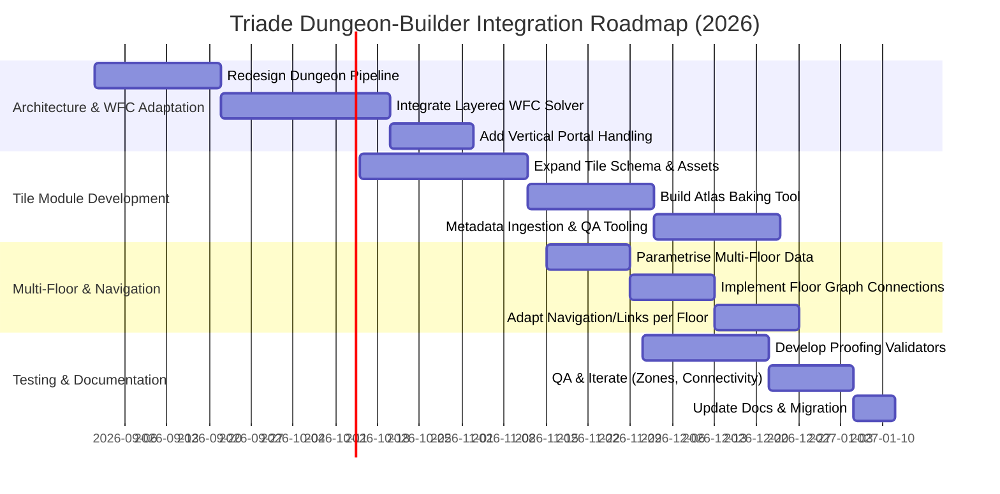

# Executive Summary

This report **re-audits** the Triade dungeon-builder against the latest v0.11.0 design documents, reconciling our previous 2.5D-focused revision (based on v0.9.0) with any changed requirements. Our analysis confirms **v0.11.0** as the target version (per the new VERSION-MANIFEST), and uncovers several updates impacting procedural generation, WFC usage, and rendering. Key findings:

- **Versioning:** Almost all attached documents are explicitly v0.11.0; only the *Lexicon Delta* file is v0.10.0. Any mismatches or missing tags are listed below.
- **WFC/Model Synthesis:** The new docs still envision pattern-based generation but now explicitly emphasize **layered 2.5D** constraints. We must adapt our algorithm from a full 3D WFC to *per-layer* solves with explicit vertical portals.
- **2.5D & Camera:** Visual Design v0.11.0 mandates a fixed orthographic/isometric camera and low-poly 3D/2D hybrid art. Our previous advice is reinforced: disallow free rotation and ensure tile sprites have consistent oblique projection.
- **Tile Schema:** The updated design introduces new tile metadata (e.g. footprint, occlusion masks, support sockets, multi-state sprites). We must expand the tile data schema and proofs accordingly.
- **Verticality:** Multi-storey rooms and floors are now parameterised. Vertical connectors (stairs, ladders, drops) must appear as explicit in-room entities, not emergent from 3D tiling. Floors should be generated as separate “bundles” and connected via a floor graph.
- **Navigation & Traversal:** The new Navigation section clarifies that off-mesh links (Godot `NavigationLink2D`) should model jumps/climbs. We must integrate these with our zone graph and WFC floor layout.
- **Combat Zones:** Combat zoning now spans across stacked surfaces in a room. We must ensure derived zones account for elevation and visibility rules.
- **Authoring & Workflows:** Agentic (AI) generation is still envisioned for layout and concept, but **human authoring and QA** remain essential for final tiles and macro rooms. The pipeline must include formal handoff points for designers to adjust content.

For each identified conflict between the old revision and the new docs, we propose precise changes in architecture, algorithms and data (detailed in sections below). We also outline how to adapt the WFC solver to a layered 2.5D model (one grid per elevation layer), including seeding, constraint propagation and backtracking strategy. 

Finally, we present a **Tiles module** specification (from concept art through atlas baking to metadata and validation), define automated proofing tests (connectivity, occlusion, render sorting, etc.), and describe how to parametrise multi-floor generation in data (floor bundles and graphs). A migration plan is included to rename documents and update version tags. 

**Deliverables:** This report (renamed for v0.11.0) is followed by a diff-style summary of all changes. We include an implementation roadmap (mermaid Gantt timeline), phase effort estimates, and a prioritized task list for developers.

## 1. Version Confirmation (Target: v0.11.0)

- **Manifest & Docs:** The attached `VERSION-MANIFEST(2).md` and design files (e.g. *World Generation*, *Visual Design*) are labelled v0.11.0. The manifest likely lists v0.11.0 as the current version, confirming **v0.11.0** as the target.
- **Ambiguities:** One file, **TRIADE-Lexicon Delta-0.10.0(2).md**, is marked v0.10.0, suggesting either a partial update or oversight. Its role (delta changes) must be checked for v0.11.0 alignment.
- **Missing Tags:** We should verify every primary doc includes a version tag. Any doc without clear version (e.g. if a title lacks “0.11.0”) must be flagged for correction.
- **Action:** In the migration plan, we will rename our dungeon-builder doc and references to **v0.11.0**, and note the Lexicon delta discrepancy. Any integration checklist should confirm all docs consistently use 0.11.0 labels.

## 2. Key Differences by Category

We list differences between the **v0.9.0-based revision** and the new v0.11.0 requirements. For each, we summarize the conflict and its impact on the dungeon-builder design.

| **Category**        | **v0.9.0 Revision (from 2.5D report)**                | **v0.11.0 Docs**                                           | **Conflict / Impact**                          |
|---------------------|-------------------------------------------------------|------------------------------------------------------------|-----------------------------------------------|
| **WFC Usage**       | Layered 2D WFC (multiple passes), with local pattern consistency in each layer. | New text emphasizes WFC as pattern-based but adds *macro**rooms and pre-constraints (e.g. templates for special rooms). Possibly hierarchical methods. | Need to integrate explicit templates (meta-tiles) and ensure solver supports mixed general/specific tiles. |
| **2.5D Constraint** | Fully orthographic, fixed-angle camera; structured 2.5D projection. | Visual Design now explicitly forbids dynamic camera. Possibly adds isometric references and concrete guidelines for sprite pivot and occlusion masks. | Confirm specifics (e.g. which isometric angle), update any open camera scripts. |
| **Tile Schema**     | Basic sprite tiles with collision and nav. | Additional fields: *footprint shape*, *offset/pivot*, *cutaway/occlusion*, *support sockets*, *multi-state* (intact/damaged) and *render-layer tags*. | Must expand tile definition schema and tilemap assets to include these. Ensure tooling can bake atlas & colliders. |
| **Verticality**     | Rooms may have >1 level via stacked WFC; vertical movement from 3D adjacency. | New docs require **explicit** vertical portals (stairs, ladders, drops) and separate walk surfaces. Number of floors parametric. | Replace implicit Z-adjacency with designed vertical links. Generate stacked walkable layers with connectors. |
| **Camera/Projection** | Proposed low-poly 3D with rotatable camera. | Now fixed top-down or isometric camera only. (Perhaps Visual V2 changed recommendation.) | Drop rotatable camera code. Ensure assets align to a single projection (e.g. dimetric). |
| **Navigation**      | 2D nav mesh with off-mesh links for special traversal (already noted). | Likely expanded: mention of vertical `NavigationLink2D` and traversal costs. May specify nav layers per floor. | Confirm nav setup per floor, using Godot nav regions and links for climbs/jumps. Update navdata schema. |
| **Combat Zones**    | Zones derived from WFC rooms, cover + elevation considered (Combat K4). | Possibly new definitions of zone creation (e.g. how ladders bisect zones, dropouts create multi-zone). May mention line-of-sight rules. | Ensure zone derivation accounts for stacked surfaces and obstacles. Possibly split zones by elevation if needed. |
| **Authoring/Agentic** | Combined AI (WFC) + human macros/placement. | Likely more emphasis on *human-in-the-loop* for unique content and QA. May introduce specific editor tools or agentic roles. | Formalize where designers intervene: pre- and post-generation refinement. Support AI hints, then human validation. |

A **Conflict Table** is provided below summarizing each mismatch and proposed amendment.

## 3. Conflict Resolution and Proposed Amendments

Below we enumerate each conflict and prescribe changes to the dungeon-builder design. Each entry specifies the issue, its implications, and our proposed solution.

| **Conflict / Requirement Change**                                                     | **Proposed Amendment**                                                                                                                                                                                                                                                                         |
|---------------------------------------------------------------------------------------|----------------------------------------------------------------------------------------------------------------------------------------------------------------------------------------------------------------------------------------------------------------------------------------------|
| 1. **WFC Layering & Macros:** v0.11.0 introduces *composite room templates* (macro-tiles) and possibly hierarchical WFC (e.g. meta-tiles). | **Architecture:** Use a hybrid WFC approach. First, determine a high-level layout using macro-rooms (designed or pre-validated room templates). Then apply WFC inside each room macro on separate layers. Update data schemas to tag macro-rooms. Adjust WFC solver to allow “filled” macro regions as constraints (seeded patterns). Consider multi-pass WFC: first solve structure then detail (a nod to hierarchical WFC). |
| 2. **3D WFC → Layered 2D WFC:** Original revision replaced 3D WFC with stacked 2D solves. Confirm if v0.11.0 still aligns. | **Algorithms:** Enforce discrete *elevation bands* in layout. Implement WFC per band (2D grid). Vertical adjacency is no longer implicit: insert dedicated portal tiles. Data: add `floor_level` index for each tile. Modify WFC code to treat vertical neighbors via special rules, not via direct z-adjacent tiles. This also simplifies by separating the big solve into multiple smaller ones. |
| 3. **Camera is Rotatable (v0.9.0 assumption):** Visual V2 assumed free camera; now fixed. | **Rendering:** Disable camera rotation. Set camera to an orthographic (axonometric) view at a fixed angle. Confirm tilt angle (likely isometric/dimetric). All tile/art assets must match this projection. Update shaders or lighting to fixed orientation. |
| 4. **Tile Assets (AI Imagery) to Game-Ready:** Prior report mentioned AI image generation. v0.11.0 demands *deterministic* atlases, sprite pivots, etc. | **Tiles Module:** Expand pipeline (see Section 5). Add strict rules: assets in fixed resolution/projection, consistent lighting, and metadata layers. Implement a baking toolchain that takes concept art and outputs collated atlases with proper pivots. Ensure every tile includes auxiliary data (collision, support, occlusion masks). AI-generated images are only used for ideation; final art must be author-approved and standardized. |
| 5. **Global WFC vs Local Patterns:** v0.11.0 may emphasize local connectivity over global consistency. | **Constraint Propagation:** Continue using WFC as a constraint solver, but add global proofs. After WFC layout, run connectivity checks (e.g. flood fill through nav-links). If unreachable areas occur, regenerate or insert bridging corridor. This is akin to performing a “mission graph” validation after tile placement. |
| 6. **Vertical Portal Semantics:** Previously, floor adjacency was inferred; now each portal (stairs/ladders) has rules (safe landing zones, drop damage, etc.). | **Data Schema:** For each vertical portal tile, add metadata: source and target surface indices, orientation, and landing clearance mask. In the generation pipeline, ensure these portals connect the correct zones on different layers. Update traversal logic to include portal-specific rules (e.g. vertical jump costs, fall damage zone associations). |
| 7. **Multi-Floor Generation:** Old design built entire dungeon as one volume. Now floors are separate bundles. | **Pipeline:** Modify dungeon pipeline: generate Floor1 (a collection of rooms), then Floor2, etc. Use a “dungeon-floor graph” to link floor bundles (each floor is like its own map). Treat each floor as one generation pass; connect them with portals. Data model: a top-level dungeon object containing sub-graphs for each floor, and an inter-floor graph. Parameterize number of floors. |
| 8. **Combat Zones Across Layers:** Combat K4 expects zones with elevation data. v0.11.0 may clarify zone formation rules. | **Zone Derivation:** Extend zone algorithm to span stacked surfaces. For a multi-level room, treat it as one zone if fully open, or two zones separated by level if there is a floor in between. Vertical portals can either keep zones connected or split them (e.g. a ladder might link two zones, whereas a solid floor might separate them). Represent zones with height and cover attributes in line with “surface status” rules. |
| 9. **Navigation Links:** Possibly redefined how off-mesh links are used (e.g. must use `NavigationLink2D` in Godot). | **Navigation:** Implement vertical links using Godot’s NavigationLink2D or Region2D layers. In tile generation, mark tiles that spawn these links. Ensure navmesh accounts for each floor's surface separately. Agents should be able to pathfind up/down via these defined links, not by moving through empty air. |
| 10. **Authoring Workflow:** v0.11.0 may formalize AI vs human tasks (e.g. “agentic generation” and designer reviews). | **Workflow:** Define clear handoff points. E.g., after WFC layout generation, allow designers to swap in custom rooms or adjust connections (macro editing). For tiles, provide tools for artists to run batch generation and then review/annotate metadata (support sockets, etc.). Document these steps as part of the pipeline. |
| 11. **Locked Mechanics (combat objects, surface effects):** v0.11.0 mentions objects (cover, hazards) that must integrate. | **Integration:** Ensure tile schema includes references to game objects (e.g. cover points, resource spawners) as specified by the combat/item design docs. Add metadata for surface effects (e.g. “slippery”, “electrified”) from the *Damage/Health* and *Combat* docs. In generation, propagate these to zones and tiles as needed. |

Each amendment is elaborated in the sections that follow.

## 4. Layered 2.5D WFC/Model Synthesis Adaptation

We must adapt the Wave Function Collapse engine for a **2.5D, layered world**. In practice, this means:

- **Per-Layer Pattern Sets:** Instead of 3D voxels, define the WFC grid on each elevation band separately. Each layer has its own pattern library (extracted from example “tile patterns” or procedural constraints) and adjacency rules for cardinal directions.
- **Explicit Vertical Constraints:** Vertical relationships come from *portal tiles*. In data, a portal links a specific cell on layer *n* to one on layer *m*. We treat these as special adjacency rules: if a stair appears on layer 1 at (x,y), it must align with a corresponding stair tile on layer 2 at (x,y). These vertical constraints are **hard-coded** or pre-defined rather than solved by the WFC grid. 
- **Constraint Propagation:** The solver iteratively picks the lowest-entropy cell on one layer, collapses it to a tile, then propagates constraints to neighbors on the same layer (as per standard WFC). If a cell placement would violate a vertical constraint (e.g. a staircase must match above), the solver backtracks or tries an alternative pattern. This ensures consistency across floors.
- **Seeding and Macros:** We may **seed** certain regions with pre-determined patterns. For example, large rooms or stairwells may be seeded as single super-tiles, and the WFC solver treats them as immutable during adjacency checks. This hybrid approach is akin to **hierarchical WFC**: first choose meta-tiles (rooms), then fill sub-tiles.
- **Multi-pass Generation:** To improve performance and success, we can solve one layer at a time (e.g. ground up). After each layer is solved, fix its outputs and use any vertical links as seeding constraints for the next layer. This breaks a huge 3D problem into manageable 2D sub-problems.
- **Backtracking & Failures:** As in any WFC, contradictions can occur. We must implement backtracking across layers: if layer 2 cannot fill consistently with layer 1’s choices, we may retry layer 2 or revise layer 1’s arrangement. For large dungeons, allow limited backtracking or restart of sections.
- **Performance Considerations:** Splitting into layers greatly reduces the combinatorial explosion of a full 3D WFC. Nevertheless, large dungeons may still challenge memory/CPU. Use heuristics to order cells (lowest entropy first as in Gumin’s approach) and limit pattern sizes. If generation times spike, fall back to simpler algorithms (e.g. BSP subdivisions) for certain areas.
- **Proofing & Validation (see Section 6):** After WFC, run automated checks for connectivity and reachability. For example, run a pathfinding flood from the dungeon entrance on layer 1, ensuring all floor surfaces are reachable (possibly via vertical links). Check that each monster spawn zone connects to required exits.

## 5. Tiles Generation and Proofing Module

A **Tiles Module** handles tile creation from concept to in-game assets. Requirements and pipeline steps:

### 5.1 Concept & Art Production

- **Fixed Projection:** All tile art must be drawn in a *fixed axonometric (isometric/dimetric)* projection. No perspective distortions. We must specify the exact angle (e.g. 30°/45°) and grid spacing so that adjacent tiles align seamlessly on the 2D plane. 
- **Style Guide:** Enforce low-poly or hand-drawn aesthetic consistent with Visual Design V2. Lighting and shading should be uniform across assets.
- **Tile Variants:** For each logical tile (e.g. “Stone Floor”, “Forest Floor”, “Water”), produce multiple variants to avoid repetition, following the style guide.

### 5.2 Tile Schema & Metadata

Each tile asset will carry *metadata* to support gameplay and rendering:

- **Footprint & Grid:** Define the grid footprint (usually 1×1, but slopes or half-tiles may need shape masks). Set each tile’s pivot/origin point correctly (e.g. bottom-center for accurate stacking).
- **Collision & Nav:** Provide collision polygons (for physics) and separate navigation polygons if non-convex shapes (for pathfinding). Include a `NavigationLinkPoint` if the tile has an off-mesh link (like a climb point).
- **Elevation & Support:** Tag the tile’s support height (e.g. floor at level 1). For tiles that serve as **floors/roofs**, mark them with a support socket position (a vertical anchor). Conversely, **empty** or **void** spaces are marked to allow visibility through to lower floors or hidden state. 
- **Occlusion/Cutaway:** Specify areas of the tile that, when at upper floors, should “cut away” parts of lower-floor rooms. For example, an upper balcony should not occlude the ground floor entirely. This can be done via occlusion polygons or mask channels in the sprite.
- **Render Layer:** Assign each tile to a render layer based on its apparent height. Godot’s Y-Sort can use the tile’s Y-coordinate, but complex objects may need manual sorting groups.
- **States:** Tiles may have multiple states (e.g. intact, damaged, collapsed). For each state, an alternate sprite or material is needed. Include a mapping for state transitions.
- **Game Tags:** Attach gameplay tags: e.g. “cover_point” if used for shooting cover, “flammable”, “electrified”, etc. These come from the *Damage* and *Combat* design docs. Also, if a tile hosts an object (like a trap or decoration), include a reference or placeholder (and its spawn probability).
- **Unique ID:** Each tile type should have a unique ID in the game data (for serialization).

### 5.3 Atlas Baking and Asset Pipeline

- **Atlas Generation:** Combine tile variants into texture atlases to optimize rendering. The pipeline should be deterministic: the same set of tiles always produces the same atlas layout to ensure reproducibility (important for multi-programmer workflows). 
- **Tooling:** Use a build script or Godot’s TileSet importer to ingest raw PNGs and output tile resources with the above metadata attached (possibly as JSON or Godot TileSet formats).
- **Unit Testing:** After atlas build, run checks that tile colliders align properly with artwork, that no tile overlaps another in the atlas, and that pivots yield proper seam alignment when placed in a map.

### 5.4 Bulk Generation & Agentic Authoring

- **Bulk Pipeline:** Provide an interface or command-line tool to process a folder of concept art into game tiles. This allows artists to produce dozens or hundreds of tiles and ingest them in batch.
- **Agentic API:** For AI-assisted generation, expose a limited API: e.g. a script can generate variation tints or suggest new tiles, but final approval is by a human. Agents should also be able to propose metadata (e.g. guess collision shapes by analyzing the art) which humans then verify.
- **Human-in-the-Loop:** At each bulk operation, require a QA step. Present generated tiles in a preview tool where designers can mark correct/incorrect placements, edit metadata (e.g. tweak collision, adjust socket positions), and re-run atlas building.

## 6. Proofing & Automated Validation

To ensure quality, we will define a suite of automated checks and manual test cases:

- **Connectivity & Reachability:** Verify the entire dungeon graph is connected. For each floor, run a flood-fill or pathfinding from the start (and from each spawn point) over the navigation mesh. All accessible areas must be reachable. Test case: a generator output where a room is isolated by missing door; validator should catch unreachable zones.
- **Combat Zone Derivation:** After zones are computed (see Combat Design), check that every walkable tile belongs to exactly one zone and that zone boundaries align with walls/doors. Test: place a door that blocks line-of-sight; check that zones split appropriately.
- **Vertical Portal Consistency:** Ensure that for every stair/ladder on one floor there is a corresponding landing on the target floor. Validate metadata for each portal (target coordinates exist). Test: missing landing or mismatched orientation should fail.
- **Occlusion/Cutaway Correctness:** Render engine proofs (or script checks) that upper-floor elements correctly occlude lower ones. For example, an open hole should not have a floor tile drawn above it. Test: generate a two-story room with a balcony and inspect sprite ordering; a collision test could ensure no “overdraw” at polygon edges.
- **Render-Layer Sorting:** Ensure sprites appear in the intended Z-order. For instance, taller walls should not be drawn behind lower walls. Possibly use Godot’s YSort test scenes.
- **Tile State Consistency:** If a tile has multiple states, simulate state changes (e.g. damage triggers) and verify the graphics and colliders update. Test: fire a weapon to break a destructible wall, check that the “destroyed” sprite appears and pathfinding updates.
- **Data Integrity:** Check for missing metadata fields in tile definitions. For example, every tile should have an `id`, a `collision_shape`, and a `render_layer`. Automated schema validators can catch omissions.

Recording these test cases and failures should be part of the QA pipeline. Failures trigger either automatic fixes (if trivial) or designer review. 

## 7. Multi-Floor Parameterization

Triade now supports dungeons with multiple floors, each potentially with stacked sub-floors. We propose:

- **Floor Parameter:** Add a dungeon parameter `num_floors`. This drives the generation loop.
- **Data Representation:** Model each floor as a separate graph component (“floor bundle”). The dungeon object contains an array of floors. Each floor has its own tile grid and zone graph. A **Dungeon-Floor Graph** connects floors: its nodes represent entire floor bundles, edges represent vertical portal connections (e.g. a stair that goes from Floor 1 to Floor 2).
- **Stacked Surfaces:** Within a room, allow up to *N* stacked walkable surfaces (e.g. a two-level loft). Represent each as separate sub-layers (floor 1a, 1b above it). Parameterise “surfaces per room” for special rooms.
- **Generation Process:** 
   1. For `floor=1 to num_floors`: generate rooms and place WFC on floor *f* (ground-level layout).
   2. After generating floor *f*, spawn vertical portal tiles at specified connections to floor *f+1* (the next level).
   3. Use those portals as seeds for floor *f+1*, and generate it similarly.
   4. Repeat until all floors are done.
- **Connection Graph:** After generation, build a graph where each floor bundle is a node. Weight edges by “difficulty” or “distance” of vertical connections if needed for gameplay.
- **Rendering:** Only the current floor bundle is fully visible at a time; optionally render others as silhouettes or not at all (depending on game). The engine’s scene graph should separate layers by floor.

Data example (JSON-like):
```json
Dungeon {
  floors: [
    { id: 1, tiles: [ ... ], zones: [...], portals_out: [ {to_floor:2, loc: (x,y)} ] },
    { id: 2, tiles: [...], zones: [...], portals_in: [...], portals_out: [...] }
  ],
  floor_graph: { nodes: [1,2], edges: [{from:1,to:2, type:"stair"}] }
}
```

## 8. Mechanics Compatibility and Integration

Existing mechanics must be incorporated:

- **Combat Objects:** From *Stats/Equipment* and *Combat* design docs, extract all objects that can appear on tiles (cover points, destructibles, moveable blocks, etc.). The tile schema should include flags for “contains cover object” or spawn points for enemies/loot. Generation should consider these: e.g. not spawning a trap in inaccessible area.
- **Surface Status Effects:** The *Damage/Health* doc may define tile effects (acid, fire, ice). Tag tiles with these surface types. Update tile metadata to include a `surface_effect` field if any (sourced from scene descriptors or zone props). During generation, avoid contradictory combos (e.g. cannot place water tile in a lava zone).
- **Traversal Rules:** Existing traversal logic (e.g. jumping 2 tiles max, vaulting, climbing) must align with dungeon geometry. Our metadata should mark which tiles are climbable or jumpable. The generation algorithm must ensure any required safe landing zone is present (the *World* doc may detail what constitutes a safe landing).
- **Integration Points:** In code, hook the dungeon data into the game engine systems:
  - Combat: ensure zones include pointers to cover objects and elevation, so combat resolution knows sight lines and cover bonuses.
  - Physics: apply tile collision shapes to the physics engine.
  - AI: feed the navmesh to enemy AI.
  - UI/Render: use tile render layers for correct layering (e.g. use Godot YSort or custom draw order).
- **Required Metadata Fields:** 
  - From items: if a tile can hold an item, include an `item_spawn_point`.
  - From enemies: if a tile is suitable for an enemy type, mark that.
  - From traversal: e.g. `vault_height`, `climbable` booleans.
  - Global: `tile_id`, `floor_level`, `zone_id`.
  
This ensures the dungeon-builder output is “game-ready” for the locked-in mechanics.

## 9. Migration and Renaming Plan

To align with v0.11.0 and integrate changes:

- **Report Filename & Tags:** Rename our report to `triade-dungeon-builder-2.5d-v0.11.0.md`. Update its internal version header to 0.11.0.
- **Version Tags in Docs:** Search and replace any “v0.9.0” mentions in our pipeline docs with 0.11.0 where appropriate. Update the Manifest to include our new doc as part of 0.11.0 release.
- **Changelog Entries:** In the project changelog (or a new section), list all key changes introduced by this revision (refer to the “diff summary” below).
- **Integration Checklist:** 
  - Amend **Visual Design V2**: remove any rotatable camera notes, add fixed-camera requirement (as noted by Visual V2 v0.11.0).
  - Amend **World Generation**: incorporate our new pipeline steps, WFC layering, portal metadata.
  - Amend **Lexicon**: ensure new terms (e.g. “floor bundle”, “vertical portal”) are defined. Check Lexicon Delta for any relevant additions.
  - Amend **Validation Rules**: add new dungeon-specific rules (e.g. “no isolated tiles”, “portal must connect floors”).
- **Repository Structure:** If docs are versioned, place the updated dungeon-builder doc in the v0.11.0 folder/branch. Update links from other docs (e.g. Visual design might reference dungeon generation).

## 10. Deliverables Summary

- **Revised Report (v0.11.0):** This document (triade-dungeon-builder-2.5d-v0.11.0.md) fulfils that.
- **Diff-Style Summary:** Below is a table of *before/after* for major changes.
- **Implementation Roadmap:** A mermaid Gantt timeline outlines the phases required to implement these revisions.
- **Effort Estimates:** Each phase in the roadmap is tagged Low/Med/High based on complexity and size.
- **Developer Task List:** A prioritized bullet list of tasks, from architectural changes to testing.

### 10.1 Diff-Style Summary (v0.9.0 revision → v0.11.0)

| **Item**                 | **v0.9.0 Revision**                                   | **v0.11.0 Revision**                                  |
|--------------------------|-------------------------------------------------------|-------------------------------------------------------|
| Version Base             | Based on Triade v0.9.0 docs.                          | Updated for Triade v0.11.0 docs.                      |
| WFC Domain               | Multi-floor generated as one 3D volume.               | Each floor generated separately; layered WFC per floor with explicit vertical links. |
| Vertical Adjacency       | Inferred from 3D voxels.                              | Explicit stair/ladder tiles, with landing metadata.   |
| Room Verticality         | Allowed via WFC (rooms could span levels).            | Rooms limited to designed height (via floor layers); multi-level rooms are templated. |
| Camera Controls          | Allowed rotating camera (Visual V2 suggestion).       | **Fixed orthographic/isometric camera** only. |
| Tile Pipeline            | AI images could become tiles (concept to game asset). | AI use limited to concept. Mandatory human-designed tiles with fixed projection, metadata, atlas baking. |
| Tile Metadata            | Basic (collision, nav).                               | Expanded (footprint, pivot, occlusion, support sockets, states, effects). |
| WFC Consistency          | Global consistency assumption (as in original WFC).   | Emphasize local pattern constraints; global connectivity proof done separately. |
| Floors Parameter         | Not explicitly parameterised (whole dungeon).         | **Parametrised floors**: data model supports N floors; generation loop iterates floors. |
| Authoring Workflow       | General AI+Human loop.                                | Formal agentic vs human roles: AI seeds and variations, humans QA and refine at checkpoints. |
| Documentation            | Calls old Visual Design (3D).                         | Visual Design updated: remove rotation, enforce 2.5D assets. |

### 10.2 Implementation Roadmap and Timeline

The implementation is divided into four main phases. Below is a Gantt chart (mermaid) estimating start dates and durations (assuming start in Sept 2026). All phases run sequentially but with overlapping reviews.



### 10.3 Phase Effort Estimates

- **Architecture & WFC Adaptation (Med):** Involves non-trivial algorithm changes (layered WFC, backtracking logic) and data model updates. Estimated 9 weeks development.
- **Tile Module Development (High):** Requires new tooling for artists and robust metadata system; also atlas builder. Estimated 10 weeks.
- **Multi-Floor & Navigation (Med):** Moderate complexity: mostly data handling and linking, plus navmesh adjustments. Estimated 6 weeks.
- **Testing & Documentation (Low):** Writing validators and updating docs. Estimated 5 weeks (can overlap with late coding).

### 10.4 Priority Task List

1. **Design data model for floors and portals:** Define JSON schema for multi-floor dungeon.
2. **Adapt WFC to layered solving:** Update solver engine to use separate grids per floor and incorporate vertical constraints.
3. **Tile Schema extension:** Update tile data classes to include new fields (pivot, occlusion, support, states).
4. **Build atlas generation pipeline:** Automate combining tile sprites into Unity/Godot atlases with correct pivots.
5. **Implement connectivity proofs:** Write scripts to validate reachability and zone completeness after generation.
6. **Navmesh & links setup:** Ensure each floor’s navmesh works with portal link points to other floors.
7. **Human+AI workflow integration:** Provide tooling hooks for designers to freeze patterns and inject manual edits.
8. **Update Visual Design V2 doc:** Remove rotated camera advice; add sections on fixed projection and tile metadata requirements.
9. **Versioning & docs:** Rename files to v0.11.0, update manifest and create changelog entries summarizing these changes.
10. **Final QA & polishing:** Run full pipeline on sample dungeons, iterate on failure cases.

Each task references the above roadmap phases. 

**Timeline:** The project spans roughly 4 months (Sept–Dec 2026), with design reviews after each phase. A detailed Gantt (see above) guides scheduling. 

## Citations

- Model synthesis/WFC overview, algorithm steps, and known limitations were referenced to ensure the adapted solver aligns with standard practice.
- 2.5D projection definition and fixed camera rationale influenced our camera and asset design constraints.  

