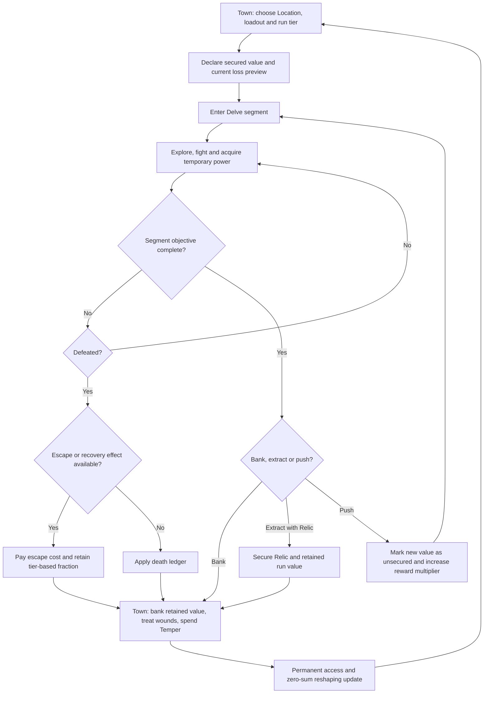

# Triade Roguelike Run, Death and Power-Scaling System

## Executive summary

The current Triade design corpus is internally consistent about its **world structure**, but not yet about the **player-facing contract of a run**. Version 0.13.0 explicitly leaves both the run/death model and the start-to-finish power multiple open, even though downstream itemisation, affix granularity, checkpoint pricing and progression pacing depend upon them. fileciteturn0file10 fileciteturn0file8 fileciteturn0file15

The most important clarification is that **3/6/1 is not presently a dungeon-complexity scale**. In the documentation, it means three Delve levels in the teaching band, six in the main mastery band and one terminal Delve level. Structural complexity rises separately through one, two and three Storeys per Delve level. The documented target durations are approximately 30–45, 60–90 and 120–180 minutes. Because Storeys partition rather than expand the fixed per-level space budget, the final one-level band cannot become two to three hours merely by using three Storeys. This is the principal pacing contradiction to resolve. fileciteturn0file14 fileciteturn0file9

The comparative evidence points towards five conclusions:

| Finding | Implication for Triade |
|---|---|
| Successful roguelites usually reset the **run build** while preserving unlocks, choices, knowledge or account progression. | Lose temporary equipment and unsecured value, not conserved baseline geometry or already purchased access. |
| Explicit short/medium/long expeditions work best when length changes recovery opportunities, provision demands and reward structure, not merely room count. | Give medium and long runs banking, camping, extraction or escape decisions. |
| Severe death feels fairer when the player can understand and influence the exposure. | Show an exact loss preview and provide a voluntary bank/push decision before major risk. |
| Longer runs need a lower **percentage** loss even though their absolute loss may remain greater. | Retain approximately 10%, 40% and 60% of unsecured fungible value on short, medium and long failures respectively, subject to testing. |
| Meta-progression should improve consistency, choice and access more than raw power. | Preserve Triade’s zero-sum floor geometry; use permanent progression for reshaping, vocabulary, routes, rerolls and loot-fit rather than uncapped stat growth. |

The recommended system is therefore a **tiered hybrid**:

* Short runs use a recognisable hard-reset roguelite model: the run build is lost, while permanent unlocks and secured Temper remain.
* Medium runs add a secured/unsecured ledger and one meaningful banking decision.
* Long runs add mandatory save-and-resume, at least one extraction opportunity, and partial-value recovery on failure.
* Carried Relics remain an opt-in cargo risk and may still be lost on collapse.
* Previously purchased Delve access should not be removed by ordinary death. Access rollback, unspent Imprint loss, temporary Ceiling loss, run-gear loss, Relic loss and paid wound recovery are too many simultaneous penalties.

Recommended provisional end-of-run power targets are **1.7× for short**, **2.5× for medium** and **3.8× for long**. These should describe *effective run power*, including gear, build synergy and expanded tactical vocabulary—not permanent increases to the conserved baseline floor budget.

## Comparative survey

The survey prioritises official game pages, official community wikis, developer talks and postmortems. It treats listed run times qualitatively unless a game itself formally distinguishes lengths. This avoids turning community speed expectations into design facts. The attached documents are treated as the authoritative source for Triade; provisional values remain proposals rather than locked decisions, in accordance with the project’s numeric philosophy. fileciteturn0file0

| Game | Run-length options | Dungeon or difficulty structure | Death cost | Persistent progression | Short, medium and long design | Primary incentive pattern | Monetisation relevance |
|---|---|---|---|---|---|---|---|
| **Dead Cells** | One continuous, no-checkpoint attempt with branching biome routes. | Biomes form alternate paths; unlocked movement runes open further routes and later difficulty options. | Death removes run items, mutations, scrolls, Cells and most gold. | Runes, unlocked paths, item availability and purchased upgrades persist. | Primarily a fixed complete-run spine; route selection changes challenge and build opportunities more than formal session length. | Bank Cells between biomes or carry exposure; pursue harder routes and permanent unlocks. Motion Twin’s GDC talk specifically describes reducing rage-quits while preserving a hardcore feel. citeturn10search3turn15search0turn8search4turn12search2 | Premium game with paid content expansions; no run-recovery monetisation. citeturn13search2 |
| **Hades** | A complete escape attempt through a fixed succession of regions, with optional challenge rooms and escalating difficulty modifiers. | Region bosses gate progression; the Pact and other systems raise difficulty without changing the fundamental run loop. | Attempt-scoped Boons and build state end when the attempt ends. | Mirror upgrades, weapons, resources, relationships and narrative progression persist. | Mainly one medium-length complete attempt; shorter sessions arise through early death rather than a separately authored short mode. | Every failure advances character relationships or narrative while permanent upgrades gradually improve consistency. citeturn9search4turn6search5turn6search6turn12search17 | Premium standalone game; no run-level monetisation indicated by the official product model. citeturn9search4 |
| **Slay the Spire** | Standard three-act climb, optional final act, Daily Climbs, Custom Mode and an Endless modifier. | Each act has its own encounters and boss; Ascension adds cumulative difficulty modifiers. | The attempt deck, relic collection and run economy reset. | Characters, cards, relic-pool entries and Ascension levels unlock across attempts. | Standard mode is a medium fixed run; the optional final act lengthens the mastery route; Endless supports deliberately long sessions. | Route risk, deck synergy and opportunity cost: a relic, key or safer path may require giving up health, gold or another reward. citeturn10search0turn8search1turn8search3turn8search51 | Premium standalone game; the official store lists no gameplay expansion model for the original game. citeturn10search10 |
| **Risk of Rain 2** | Defeat a final boss and escape, voluntarily end through special routes, or loop indefinitely. | Both player and enemy power rise throughout a run; stages repeat in increasingly hostile loops. | Death resets level, gold, equipment and collected run items. | Survivor, skill, item-pool and modifier unlocks persist; Lunar Coins carry between games. | Supports relatively short successful escapes, medium multi-stage runs and genuinely long or endless looping. | Continuous tension between searching for more items and allowing the global difficulty clock to advance. citeturn9search0turn14search0turn14search16 | Premium game with paid expansions; no death-insurance monetisation. citeturn9search0 |
| **Rogue Legacy 2** | Players may enter briefly, explore selected biomes, challenge bosses or continue until the current heir dies. | Persistent world access and biome progression sit beside highly variable individual heir runs. | The heir dies and temporary run state ends; remaining gold is exposed to Charon’s entry toll after upgrade spending. | Manor upgrades, equipment, runes, heirlooms and access progression persist. | Explicitly accommodates “hard and fast” or slow accumulation; individual lives may be short while the family campaign is long. | Convert inheritance into permanent family power, then test a new combination of class and traits. citeturn8search11turn14search14turn8search9 | Premium standalone title; no DLC is listed on its official Steam DLC page. citeturn13search5 |
| **Darkest Dungeon** | Formally offers short, medium and long expeditions. | Length changes dungeon size and branching; medium and long expeditions add one and two camps. Difficulty is separately controlled by expedition rank. | Hero death is permanent; abilities and upgrades on that hero are lost. Stress, disease and treatment costs may survive successful expeditions. | Hamlet buildings, roster development, resources and campaign access persist. | The clearest precedent for distinct length tiers: longer missions demand provisions and stress control but provide camps and stronger rewards. | Choose how much roster value, supply cost and accumulated stress to expose for better loot and campaign progress. citeturn7search1turn7search4turn7search9turn6search12 | Premium game with paid and free expansions. citeturn13search1 |
| **Enter the Gungeon** | Main chamber sequence, optional secret chambers, shortcuts, challenge variants and occasional resurrection items. | Successive chambers escalate enemies and costs; secret chambers extend the route and require resources or knowledge. | Ordinary death ends the run and its collected build, apart from exceptional resurrection items such as Clone or Gun Soul. | Hegemony Credits purchase permanent item-pool unlocks, modes and shortcuts. | A fixed main run with optional longer secret routes; shortcuts can create abbreviated practice or progression attempts. | Flawless bosses increase permanent currency; players choose whether to spend scarce keys and resources on optional chambers. citeturn10search4turn7search0turn15search7turn15search10turn15search14 | Premium game; collector’s-edition extras exist, but the run economy is not monetised. citeturn10search4 |
| **The Binding of Isaac: Rebirth** | Standard branching chapter routes, challenges, Greed Mode, alternate endings and optional Victory Laps. | Multiple route branches lead to different terminal bosses; Greed Mode uses a separate wave economy. | A normal death ends the accumulated run build. | Characters, items, challenges, routes and completion marks unlock future content. | Challenges and Greed Mode provide compact alternatives; extended routes and Victory Laps support long-form power accumulation. | Discover high-variance item interactions, pursue specific completion marks and accept optional route risks for unlocks. citeturn10search2turn7search16turn15search15 | Premium base game with several paid expansions and a free online update. citeturn13search0 |

Several patterns recur across these games.

First, **the run’s temporary build is usually the primary stake**. Even highly persistent roguelites such as Hades and Rogue Legacy 2 generally let the player lose the particular build while retaining account-level options and progression. Dead Cells sharply removes unbanked run assets but permanently preserves opened paths and unlocks; Enter the Gungeon does the same with its item pool and Hegemony Credits. citeturn15search0turn9search4turn7search0turn8search11

Second, **length and complexity are not the same variable**. Darkest Dungeon’s long expeditions have more branching and resource load, but they also introduce camps; Slay the Spire’s optional final act lengthens the run with a concentrated challenge; Risk of Rain 2 can continue indefinitely, but its time-based pressure makes additional duration itself a risk. The strongest models compensate long commitments with a recovery mechanism, a voluntary stopping point or a distinct reward structure. citeturn7search1turn8search3turn9search0

Third, death penalties are judged through context and player agency, not only their numeric magnitude. Research on permadeath argues that positive experiences require the loss to feel meaningful, while broader work on game death shows that the same nominal penalty can feel trivial or consequential depending on how it is framed and experienced. citeturn11search3turn11search1turn11search8 This supports Triade’s existing principle that severe collapse is licensed by a prior decision not to protect progress—but only if the protection choice is legible, affordable and made close enough to the danger to remain psychologically connected. fileciteturn0file14

Finally, the benchmark games are overwhelmingly **premium products whose run economies are not real-money economies**. Paid DLC generally adds content rather than selling resurrection, retained currency or reduced death penalties. Triade should preserve that separation unless its commercial model changes explicitly; otherwise balance telemetry becomes entangled with monetisation pressure.

## Triade run-structure diagnosis

The attached design defines a Stratum as ten Delve levels divided around one escalating boss:

| Documented band | Delve levels | Boss state | Target duration | Storeys per Delve | Effective role |
|---|---:|---|---:|---:|---|
| Early | 1–3 | First form at 3 | 30–45 minutes | 1 | Teaching and initial build formation |
| Middle | 4–9 | Second form at 9 | 60–90 minutes | 2 | Main mastery and build differentiation |
| Terminal | 10 | Third form at 10 | 120–180 minutes | 3 | Final examination and culmination |

A town return follows levels 3 and 9; the final level auto-locks on success. The return is intended to unify resupply, checkpoint purchase, Temper spending and banking. Collapse currently reverts to the last purchased checkpoint and removes Delve access, unspent Imprint and the Modification Ceiling earned inside the collapsed Stratum. A carried Relic may also be lost, while wounds or recovery costs can persist through the broader health model. fileciteturn0file14 fileciteturn0file5

**Interpretation of 3/6/1.** Two readings should be separated:

| Reading | Meaning | Evaluation |
|---|---|---|
| **Corpus reading** | Three early Delves, six middle Delves, one terminal Delve; structural complexity is separately 1/2/3 Storeys. | Conceptually strong as *teaching → mastery → examination*. The escalating boss encounters reinforce learned recognition. The duration of the final band is not explained by its space structure. |
| **Fallback reading requested in the brief** | Short complexity = 1 unit, medium = 3, long = 6. | Monotonic and easy to communicate, but it wrongly binds duration to authored complexity. A six-unit long run risks six times the production surface, six times the navigation burden and excessive content fatigue unless units are much smaller. |

The corpus reading should be retained, but renamed internally as **band distribution 3/6/1**, not “complexity mapping”. Use a separate complexity index such as **C1/C2/C3** for one-, two- and three-Storey structures.

**The duration contradiction.** The first two bands imply approximately 10–15 minutes per Delve:

\[
\frac{30\text{–}45}{3}=10\text{–}15\text{ minutes},
\qquad
\frac{60\text{–}90}{6}=10\text{–}15\text{ minutes}.
\]

The terminal band implies 120–180 minutes for its single Delve—approximately **eight to eighteen times** the per-Delve duration of the other bands. Yet the world document explicitly states that three Storeys partition the existing space budget rather than multiply it. fileciteturn0file14 fileciteturn0file9

At least one of the following must therefore change:

| Resolution | Consequence |
|---|---|
| Reduce terminal target to roughly **60–100 minutes**. | Most coherent with a fixed per-Delve space budget and one terminal examination. |
| Keep two to three hours but define level 10 as a multi-phase terminal run with replenished space budgets. | Requires an explicit exception to the “Storeys partition, not multiply” rule. |
| Keep two to three hours through repeated boss phases and high combat density. | Likely to produce fatigue and make one failure feel disproportionate, especially in an AP-based tactical game. |
| Keep two to three hours but add suspension, extraction and partial checkpoints between Storeys. | Technically viable, but it ceases to behave like one indivisible run for death-cost purposes. |

The recommended choice is a **75–110-minute terminal run**, with save-and-resume and one optional extraction point. If the creative requirement for two to three hours remains, treat each terminal Storey as a full economic segment rather than pretending all three are a single fixed-budget Delve.

**Death-cost cohesion.** Current collapse can affect at least five value channels:

1. temporary run equipment and build state;
2. unspent Imprint;
3. Modification Ceiling gained in the current Stratum;
4. Delve access;
5. carried Relics;
6. indirectly, persistent wounds and paid recovery.

That is too many simultaneous answers to “what did death cost?” The player may understand each subsystem separately but still experience the result as a compound rollback. It also weakens the intended distinction between **capability**, **access**, **temporary build power** and **optional cargo**.

A clearer hierarchy is:

| Value class | Recommended ordinary-death rule |
|---|---|
| Baseline Triade geometry, class identity and purchased permanent reshaping | Never lost |
| Previously purchased Delve access/checkpoints | Never lost through ordinary combat death |
| Temporary equipment, consumable state and run-only techniques | Lost unless explicitly secured |
| Unspent renewable currency | Partially retained according to run tier |
| Unspent Imprint earned since the last bank | Partially lost; do not also revoke already purchased access |
| Current-Stratum temporary Modification Ceiling | Lost on collapse |
| Carried Relic | Lost unless extracted; remains the distinctive cargo stake |
| Wounds | May persist, but treatment uses renewable resources rather than progress currencies |

This preserves the documentation’s conserved baseline and its rule that recovery must not consume progress currencies. fileciteturn0file12 fileciteturn0file5 It also makes the Relic meaningful: it is the explicit optional object whose loss can be severe, rather than one penalty among many.

**Expected player outcomes under the current model.** Short runs should feel decisive and replayable. Medium runs should create the central “bank or push” tension. Long runs should feel like protected expeditions rather than endurance tests whose final fifteen minutes can erase three hours. Without that differentiation, likely behavioural outcomes include conservative farming of already understood content, refusal to carry Relics, over-purchase of checkpoints regardless of price, abandonment of terminal attempts after weak early drops and resentment towards persistent wound costs.

The recommended lifecycle is:

## Death-model designs

The death model should vary by run tier. Applying one uniform percentage to all runs either trivialises short failure or makes long failure intolerable.

| Model | Core rules | Best tier | Advantages | Risks and behavioural effects | Numerical example |
|---|---|---|---|---|---|
| **Hard reset with meta-progression** | All temporary gear, run currency and run-only techniques are lost. Permanent unlocks, secured Temper, routes and zero-sum floor reshaping persist. | Short | Strong tension; easy to explain and test; keeps item acquisition meaningful. Mirrors Dead Cells, Gungeon and Isaac-like run stakes. | Can feel repetitive if early build formation is slow. Encourages fast restarts and aggressive experimentation. | Player dies after 35 minutes with 300 Marks and six temporary items: items and Marks are lost; permanent unlocks and previously secured Temper remain. |
| **Secured/unsecured ledger** | Every reward is classified as already secured or exposed. Death retains all secured value plus a tier-specific fraction of exposed fungible value. Temporary build items normally disappear. | Medium | Makes exact risk legible; supports meaningful bank-or-push decisions; separates access from unspent earnings. | Players may bank too frequently if friction and checkpoint price are low. The UI must show the ledger continuously. | Player has 800 exposed Marks and 120 exposed Imprint. With 40% death retention, failure returns 320 Marks and 48 Imprint; previously purchased access is unchanged. |
| **Checkpoint and escape model** | Long runs contain authored extraction points. Ordinary banking ends the current exposure. An emergency escape returns a larger fraction than death but forfeits some reward, boss access or cargo. | Long | Protects time investment and creates self-determined session exits. Supports two- to three-hour content only if suspension and extraction are reliable. | An escape that is too cheap removes tension; one that requires a scarce progress currency becomes effectively unavailable. Encourages rational retreat from weak builds. | After Storey 2, the player carries 1,600 Marks, 180 Imprint and a Relic. Escape returns 65% of fungible value but loses the Relic and terminal reward; death returns 60% and applies wound consequences. |
| **Pre-run insurance contract** | Before departure, the player pays a renewable-currency premium to protect one category: currency, one item, wound treatment or cargo. Insurance never protects every category simultaneously. | Optional overlay, especially medium/long | Creates a trade/economy sink and lets risk preference become a build choice. Produces telemetry about what players value. | Can become a mandatory tax if premium is too low; can encourage tedious optimisation; must not be sold for real money. | Pay 60 Marks before a run whose expected exposed earnings are 750 Marks. On death, protect either 50% of Marks or one chosen item—not both. |

**Recommended combined model.** Implement the first three as one coherent system rather than separate game modes:

\[
V_{\text{returned}}
=
V_{\text{secured}}
+
r_t V_{\text{unsecured}}
-
C_{\text{escape}},
\]

where \(r_t\) is the retention fraction for tier \(t\).

Initial test values should be:

| Run tier | Ordinary-death retention \(r_t\) | Emergency-escape retention | Banking opportunities | Main item consequence |
|---|---:|---:|---:|---|
| Short | 0.10 | Not normally available | End only | Entire temporary build lost |
| Medium | 0.40 | 0.60 | One major bank decision | Entire temporary build lost; one insured item optional |
| Long | 0.60 | 0.70 | At least one extraction plus final bank | Temporary build lost on death; limited item salvage may be tested |

Long runs receive the greatest percentage retention because they expose the most player time. They can still have the greatest absolute loss.

A useful balancing measure is **expected loss burden per hour**:

\[
B_t =
\frac{
p_{\text{failure},t}
(1-r_t)
V_{\text{unsecured},t}
}{
T_t
}.
\]

Illustrative provisional values produce comparable burdens:

| Tier | Duration | Failure probability | Exposed value | Retained | Expected loss per hour |
|---|---:|---:|---:|---:|---:|
| Short | 0.625 h | 40% | 300 | 10% | 173 value units/h |
| Medium | 1.25 h | 55% | 800 | 40% | 211 value units/h |
| Long | 2.5 h | 70% | 1,600 | 60% | 179 value units/h |

These are not final economy values. Their purpose is to show the correct invariant: **the emotional and economic burden per hour should be in the same broad band**, even though completion rates, absolute prizes and nominal death losses differ.

**Checkpoint pricing.** A checkpoint should be paid in renewable Marks or an equivalent town currency, never Temper or Imprint. The documentation already identifies Stratum lock cost as one of the broadest-impact curves and prohibits recovery from consuming progression currencies. fileciteturn0file9 fileciteturn0file5

A starting rule is:

\[
C_{\text{checkpoint}}
=
0.12 \times
\mathbb{E}[\text{next-segment gross Marks}],
\]

with a test band of 8–18%. Below that range it is likely to become automatic; above it, players may rationally accept collapse or farm safer content instead.

**Escape pricing.** Escape should generally sacrifice upside rather than existing permanent progress. Appropriate costs include losing the carried Relic, forfeiting the segment-completion multiplier, retaining only part of exposed loot, or accepting a temporary wound. Spending Temper on escape could create a dramatic exceptional choice, as contemplated in the core design, but should not be the default because Temper already owns permanent floor reshaping. fileciteturn0file4

## Power scaling and multiplier design

The open “target power multiple” should measure the strength of a viable build at the end of a run relative to its start. It must not be confused with permanent base-floor expansion, which the validation rules prohibit. Permanent progression may reshape conserved fields, open routes and improve build fit, but should not generate an unrestricted multiplicative stat ladder. fileciteturn0file10 fileciteturn0file12

Define normalised run progress \(x\in[0,1]\) and target end multiplier \(R_t\). A simple geometric target is:

\[
P_t(x)=R_t^x.
\]

This has three useful properties: the curve is smooth, every proportional segment carries comparable growth, and acquisition values can be derived directly rather than guessed.

Recommended first-pass targets are:

| Tier | Target \(R_t\) | Mid-run power \(P_t(0.5)\) | Intended feel |
|---|---:|---:|---|
| Short | 1.70× | 1.30× | Fast identity formation; limited synergy depth |
| Medium | 2.50× | 1.58× | Full build expression and meaningful adaptation |
| Long | 3.80× | 1.95× | Transformative build with stronger interaction chains, but still bounded |

[Download the progression-curve chart](sandbox:/mnt/data/triade_power_curves.png)

If a tier contains \(n\) major power acquisitions, the average multiplicative value per acquisition is:

\[
g_t = R_t^{1/n}-1.
\]

| Tier | Major acquisitions \(n\) | Required average \(g_t\) |
|---|---:|---:|
| Short | 6 | 9.25% |
| Medium | 12 | 7.93% |
| Long | 20 | 6.90% |

This declining per-pick value is desirable. Longer runs should gain power through **interaction density and build completion**, not simply larger individual affix numbers. It also aligns with Triade’s item philosophy that rarity represents mechanical demand and behavioural specificity rather than magnitude alone. fileciteturn0file10

The effective run-power model should be decomposed:

\[
P_{\text{effective}}
=
P_{\text{gear}}
\times
P_{\text{synergy}}
\times
P_{\text{vocabulary}}
\times
P_{\text{execution}}.
\]

For balance instrumentation, however, use logs:

\[
\ln P_{\text{effective}}
=
\ln P_{\text{gear}}
+
\ln P_{\text{synergy}}
+
\ln P_{\text{vocabulary}}
+
\ln P_{\text{execution}}.
\]

This makes multiplicative contributions additive in the analysis and allows the simulator to identify whether an overpowered run came from raw item magnitude, a particular interaction, unusually broad skill access or high execution efficiency.

A sensible budget division at the end of a medium run is:

| Source | Share of log-power gain | Design purpose |
|---|---:|---|
| Item level and ordinary affixes | 45–55% | Reliable progression floor |
| Behavioural or Triade-changing affixes | 15–25% | Build identity and positional expression |
| Synergies and conditional interactions | 15–25% | Mastery ceiling |
| Temporary technique or vocabulary access | 10–15% | Tactical breadth without permanent stat inflation |

No single interaction should deliver more than roughly 20% of the tier’s total log-power gain unless it is a deliberately authored unique with a named drawback. This supports the existing validation requirement that every reinforcing loop have a named brake. fileciteturn0file12

**Enemy scaling.** Enemy power should follow expected player power but create a gradually rising challenge ratio:

\[
E_t(x)
=
P_t(x)(0.92+0.18x).
\]

Thus expected enemies begin at approximately 92% of reference build power and end at approximately 110%. This is not a direct damage multiplier; it is a composite encounter budget covering enemy durability, action quality, behavioural tags, spatial pressure and resource denial. Raising all enemy health alone would lengthen combat without testing the Triade.

For a medium run:

\[
P(0.5)=2.5^{0.5}\approx1.58,
\]

\[
E(0.5)\approx1.58(1.01)\approx1.60.
\]

The midpoint therefore tests a nearly even reference build, while the end requires the player to exploit synergy and execution rather than merely having collected an average quantity of gear.

**Risk/reward scaling.** Let \(C\in\{1,2,3\}\) be structural complexity and \(U\in[0,1]\) the fraction of current value that is unsecured:

\[
M_{\text{reward}}
=
1+0.12(C-1)+0.18U.
\]

A C3 terminal segment with 75% of current value exposed yields:

\[
M_{\text{reward}}
=
1+0.24+0.135
=
1.375.
\]

The player therefore receives a 37.5% reward uplift for accepting both high structural complexity and substantial unsecured exposure. The constants must be swept, but the decomposition is preferable to a single opaque “depth bonus”: it lets designers tune complexity reward independently from push-your-luck reward.

**Meta-progression.** Triade’s permanent advancement should primarily change the distribution of attainable builds:

\[
M_{\text{fit}}(k)
=
1+\min(0.10,\;0.03\sqrt{k}),
\]

where \(k\) is the number of relevant permanent choice or compatibility unlocks. This is an *effective fit benefit* measured by simulation, not a literal stat multiplier. At \(k=9\), the model reaches 1.09× and is close to its cap.

Appropriate sources include additional starting choices, shape-aware loot bias, vocabulary access, route access, rerolls and zero-sum floor reshaping. Inappropriate sources include permanent additions to the 0.45 floor budget, uncapped damage growth or an account-level multiplier that makes early encounters obsolete. The latter would contradict the project’s conserved-field invariants. fileciteturn0file7 fileciteturn0file12

## Validation metrics and experiments

The design should be validated in the headless deterministic simulator before economy values become content commitments. This follows the project roadmap, which places the simulation harness before the full inventory and economy implementation. fileciteturn0file1

The following targets are provisional **[SIM] bands**, not industry universals:

| Metric | Initial target or comparison | What failure indicates |
|---|---|---|
| **Run completion rate after ten prior attempts** | Short 55–70%; medium 35–55%; long 25–45% | Too high: risk and build tests are weak. Too low: death burden or early variance dominates learning. |
| **Median elapsed run time** | Short 30–45 min; medium 60–90 min; long 75–110 min unless explicitly segmented | Content density or combat duration is inconsistent with the tier contract. |
| **P90-to-median duration ratio** | Below 1.5 for fixed-length tiers | Excessive navigation, stall strategies or encounter variance. |
| **Voluntary extraction rate** | Medium 10–25%; long 20–40% | Too low: extraction is hidden or dominated. Too high: late reward is insufficient or terminal risk excessive. |
| **Checkpoint purchase rate when offered** | 35–65% | Near 100%: automatic tax. Near 0%: overpriced, unclear or strategically irrelevant. |
| **Expected loss burden per hour** | Within ±15–20% across tiers | One tier is economically irrational or emotionally punitive. |
| **Loss-prediction comprehension** | At least 90% correctly identify what will be lost before pushing | The ledger or terminology is not legible. |
| **Perceived fairness after death** | At least 75% rate 4 or 5 on a five-point fairness item | Loss felt arbitrary, disproportionate or insufficiently connected to a choice. |
| **Effective end-power multiple** | Medians close to 1.7× / 2.5× / 3.8× | Affix budget, drop count or synergy incidence is wrong. |
| **Power spread** | End-run P90/P10 below roughly 1.6 outside deliberate high-variance modes | RNG dominates execution and route choices. |
| **Meaningful acquisition cadence** | One build-relevant choice every 6–10 minutes short; 8–12 minutes medium/long | Too sparse: weak runs feel predetermined. Too dense: items become unreadable and disposable. |
| **Dead-build incidence** | Fewer than 5% of runs reach the midpoint with no viable skill-access or damage plan | Smart-loot dial, pity counters or vocabulary compatibility are insufficient. |
| **Death-source distribution** | No ordinary encounter archetype dominates more than 15–20% without design intent | Difficulty spike, unreadable telegraph or generation bias. |
| **Post-death restart latency** | Median under 90 seconds for short and medium modes | Town friction or upgrade screens interrupt the learning loop. |
| **Abandonment before a formal outcome** | Lower than death rate; separately track pauses and save-resume | Runs lack self-determined exit points or weak builds are too obvious too early. |
| **D1/D7/D30 retention** | Compare variants and confidence intervals rather than impose a universal target | Run model may be affecting willingness to return, but cohort and acquisition source must be controlled. |

The distinction between **death**, **voluntary extraction**, **manual abandonment**, **save-and-resume** and **inactivity timeout** is critical. Treating all unfinished runs as failures would misdiagnose session-length problems as combat-balance problems.

Recommended A/B tests are:

| Test | Variant A | Variant B | Primary metric | Guardrails |
|---|---|---|---|---|
| **Long-run duration** | 80–100-minute terminal segment | 130–170-minute terminal segment with Storey extraction | Completion and later-session return | Fairness, abandonment, fatigue survey |
| **Medium death retention** | 40% exposed currency retained | 55% retained | Restart rate and subsequent medium-run choice | Inflation, checkpoint purchase |
| **Long death retention** | 60% retained | 70% retained | Long-tier re-entry within seven days | Economy accumulation, perceived stakes |
| **Checkpoint price** | 10% expected next-segment earnings | 16% | Purchase split and push success | Farming behaviour, economic stagnation |
| **Exact loss preview** | Category icons only | Exact secured/unsecured amounts | Comprehension and fairness | Decision time, UI overload |
| **Power curve** | Geometric \(R^x\) | Front-loaded curve reaching 60% of growth by midpoint | Weak-run abandonment and comeback rate | End-power spread, boss completion |
| **Escape availability** | One escape after Storey 2 | Escapes after Storeys 1 and 2 | Voluntary exit and run satisfaction | Excessive low-risk farming |
| **Relic insurance** | Relic always lost on failed extraction | Renewable-currency premium protects Relic once | Relic carry rate and economy sink usage | Mandatory-tax perception |
| **Access rollback** | Current design: collapsed Delve access can be lost | Purchased access never rolls back | Fairness, long-term progression velocity | Reduced checkpoint value |

Account-level randomisation is preferable to per-run randomisation for persistent systems, because a player experiencing both death models can change behaviour based on the earlier variant. Stratify by prior roguelite experience, player skill, platform and number of completed runs. Use identical or balanced seed sets where possible.

Retention and playtime data are censored: many players remain active when an experiment is evaluated. Survival analysis and Cox models are better suited than comparing raw average playtime or fixed-day percentages alone, and have been specifically proposed for game-development A/B tests with heterogeneous follow-up periods. citeturn11search0turn11academia45

Slay the Spire’s GDC postmortem is especially relevant to Triade’s proposed workflow: Mega Crit combined metrics-driven balancing, Early Access observation and community feedback rather than treating telemetry as a substitute for game feel. citeturn12search1 Triade should adopt the same separation: simulation establishes whether a number violates the target band; playtests establish whether the resulting loss and power trajectory feel understandable, fair and exciting.

## Prioritised implementation roadmap

| Priority | Work package | Deliverable and exit criterion |
|---|---|---|
| **Immediate** | **Resolve the run contract** | Rename 3/6/1 as the band distribution; reserve C1/C2/C3 for structural complexity. Decide whether the terminal target is 75–110 minutes or a genuinely segmented two-to-three-hour expedition. No item or checkpoint tuning should proceed while this remains ambiguous. |
| **Immediate** | **Define the value ledger** | Every persistent or temporary object receives `secured`, `unsecured`, `lost_on_death`, `lost_on_escape`, `lost_on_collapse` and `bank_trigger` semantics. Purchased access must be separated from unspent Imprint. |
| **Immediate** | **Choose the default death hierarchy** | Lock the rule that ordinary death loses the run build, partially loses unsecured fungible value, preserves purchased access and permanent zero-sum reshaping, and separately resolves carried Relics and wounds. |
| **Next** | **Implement the headless run simulator** | Deterministic simulation of run duration, acquisitions, power multiple, failure position, banking decisions and death-value outcomes across at least 10,000 seeds per reference build. This is consistent with the existing architecture and validation plan. fileciteturn0file13 |
| **Next** | **Prototype short and medium tiers only** | Short hard-reset loop and medium ledger/checkpoint loop playable end to end. Exit when loss comprehension exceeds 90% and both tiers meet duration and completion bands. |
| **Next** | **Calibrate acquisition and power curves** | Set major acquisition count, item power budgets, pity rules and smart-loot bias so median end power approaches 1.7× and 2.5× without dead-build incidence above 5%. Resolve M2 only after this sweep. |
| **Following** | **Add the long-run protection layer** | Save-and-resume, authored extraction, emergency escape and long-tier retention. Do not ship a two-hour terminal run before these are reliable under crashes, suspends and platform restarts. |
| **Following** | **Tune checkpoint and lock economics** | Sweep checkpoint price, Stratum lock price and descent discounts together. Record push, bank, farm and abandonment rates; the current register correctly identifies this curve as having broad system impact. fileciteturn0file9 |
| **Later** | **Integrate Relics and optional insurance** | Relic cargo risk becomes the high-stakes exception. Test one renewable-currency insurance option only after the baseline loss model is stable. |
| **Later** | **Validate Incursions separately** | Incursions have no checkpoint or Stratum progression and should use a consciously harsher full-run model. Their item-level saturation and net Marks yield require a separate economy sweep rather than inheriting Location-run values. fileciteturn0file14 |
| **Continuous** | **Telemetry and qualitative review** | Dashboard completion, duration, loss burden, power curves, extraction, fairness and retention. Every provisional number retains a basis, gate and declared failure response, as required by the project’s SIM-number process. fileciteturn0file9 |

The single highest-value implementation decision is to build **secured versus unsecured value** as a general ledger rather than hard-coding a distinct death script for every currency. That abstraction supports collapse, escape, banking, Relics, insurance, Incursions and future economy additions while keeping the player-facing rule concise:

> **What you secured is safe. What you carried is at risk. Longer commitments recover more of what was exposed, but the temporary build still dies with the run.**