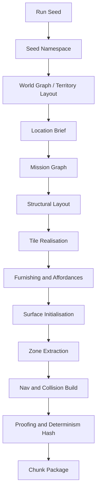

# Triade Roguelike — World, Maps & Dungeons Design Plan

**Version:** 0.43.0
**Date:** 25 September 2026
**Status:** Merged draft — architecture settled, numbers pending simulation
**File convention:** `W-World_Generation_design_TRIADE-0_43_0.md` → `outputs/analysis/`

**Document set:** this is one of **ten**.

| Ref | Document | Filename |
| --- | --- | --- |
| **T** | Core Mechanic | `T-Core_Mechanic_design_TRIADE-0_43_0.md` |
| **M** | Stats, Items, Equipment | `M-Stats_Items_Equipment_design_TRIADE-0_43_0.md` |
| **L** | Lexicon | `L-Lexicon_design_TRIADE-0_43_0.md` |
| **V** | Visual Design | `V-Visual_design_TRIADE-0_43_0.md` |
| **K** | Combat Design | `K-Combat_design_TRIADE-0_43_0.md` |
| **W** | **World, Maps & Dungeons** — *this document* | `W-World_Generation_design_TRIADE-0_43_0.md` |
| **H** | Damage & Health | `H-Damage_Health_design_TRIADE-0_43_0.md` |
| **E** | Enemies & Bestiary | `E-Enemies_design_TRIADE-0_43_0.md` |
| **G** | Tile Pipeline | `G-Tile_Pipeline_design_TRIADE-0_43_0.md` |
| **P** | **Content Pipeline & Data Model** | `P-Content_Pipeline_design_TRIADE-0_43_0.md` |

---

## Provenance markers

This document is a reconciliation of two independently written reports plus the decisions settled in discussion. Every non-obvious decision is marked so the merge is auditable:

| Marker | Meaning |
| --- | --- |
| **[W]** | Carried from the Claude-authored report |
| **[U]** | Carried from the user-authored report |
| **[BOTH]** | Independently converged in both reports — treated as high-confidence |
| **[NEW]** | Emerged during reconciliation discussion; in neither original |
| **[LEXICON+]** | New term proposed as *provisional* for `triade-lexicon` |
| **[SIM]** | Number is a provisional target; final value derived from simulation per K17 |
| **[OPEN]** | Explicitly unresolved; listed in §19 |

## Source documents consumed

All at **0.39.0**, from the authoritative `X:\Documentation` set:

- `T-Core_Mechanic_design_TRIADE-0_43_0.md` — **T**
- `M-Stats_Items_Equipment_design_TRIADE-0_43_0.md` — **M**
- `L-Lexicon_design_TRIADE-0_43_0.md` — **L**
- `V-Visual_design_TRIADE-0_43_0.md` — **V**
- `K-Combat_design_TRIADE-0_43_0.md` — **K**
- `H-Damage_Health_design_TRIADE-0_43_0.md` — **H**
- `E-Enemies_design_TRIADE-0_43_0.md` — **E**
- `G-Tile_Pipeline_design_TRIADE-0_43_0.md` — **G**
- `P-Content_Pipeline_design_TRIADE-0_43_0.md` — **P**

This document is **W**. It owns world/Territory/location/map generation, the tile substrate, affordances, surfaces, dungeon structure, generation validation, world-scoped meta-progression, and the agentic authoring pipeline for world content. It does **not** own the Triade state model, the credit economy, the action contract, or zone-graph combat rules.

**Outbound dependency — DISCHARGED at 0.10.0.** Injury persistence, the injury→stat-modifier→effective-field pathway, and the crushed-field lockout risk were reassigned to the Damage & Health workstream (see §5.6a). **H now rules** on all three: H·9.3 (channel-split persistence), H·6.1 (the pathway), and H·10.2 (the Trauma Safety Clamp). W's provisional symmetric assumption is superseded; §16 proofing and §18.1 save-state sizing are re-derived accordingly.

---

## 1. Reconciliation summary

### 1.1 Independent convergence [BOTH]

Both reports arrived at the following without contact. This convergence is the strongest evidence in either document and these points are treated as settled:

| Decision | Status |
| --- | --- |
| Tile substrate for authoring/nav/streaming/surfaces; **derived sparse zone overlay** for combat | Settled |
| Mission graph is authoritative for topology; tiles realise it second | Settled |
| Furnishing is a **separate pass** after layout and progression proofing | Settled |
| Hierarchical seed namespaces with named per-domain streams | Settled |
| Generator and verifier must be separate agents | Settled |
| Human-owned **World Steward** authority over grammar and schemas | Settled |
| ~16 bytes per logical tile cell | Settled |
| Square logical lattice, not hex | Settled |
| Procedural arrangement of authored content over pure generation | Settled |

### 1.2 Adopted from the user report [U]

| Element | Reason |
| --- | --- |
| Internal API contract (§16) | Makes the design implementable rather than descriptive |
| Zone extraction algorithm (§12) | Actual method where W had only a pipeline slot |
| Affordance/smart-slot/reservation model (§10) | Materially better than W's flat prop schema |
| Off-mesh links for climb/vault/jump | Correct encoding for non-grid traversal |
| Counter-based RNG as the outer layer (§7) | Correct primitive for coordinate-addressable lazy generation |
| Continuous multi-channel surface state (§11) | Avoids the enum explosion in W's discrete model |
| Destruction-state proofing rule | Catches a real bug W would have shipped |
| Square-lattice argument | W assumed it; U justified it |
| Agent roster (§17) | Better factored than W's |
| Phased migration plan (§20) | Retained structurally |

### 1.3 Adopted from the Claude report [W]

| Element | Reason |
| --- | --- |
| Triade-axis Territory mapping and generation biases (§5) | U's report was defensive about Triade; W makes the world *generative* of it |
| Named-reaction legibility layer over channels (§11) | Satisfies K12's cap on visible conditions |
| ERA-void → agent-brief loop (§17) | Makes the agent roster self-directing |
| Append-only `generator_version` (§7) | Distinct problem from U's `content_revision`; both ship |
| Delta-over-seed persistence (§18) | Now stronger under run-structure |
| Staged rollout with thresholds (§20) | Retained and merged with U's phases |

### 1.4 Corrections made during reconciliation [NEW]

| Correction | Origin |
| --- | --- |
| **Territory count decoupled from the three Triade axes.** Many Territories, each declaring one axis. Nothing in schema knows the number three. | W's one-to-one mapping would have blocked the first expansion |
| **Surface channels quantised to integer fixed-point, advanced by `world_tick` pulses.** No floats, no `dt` in the simulation core. | U's float accumulation loop was a cross-platform determinism hazard against a locked requirement |
| **Lore attaches at the Territory/landmark layer, not the location instance layer.** | Resolves the run-structured/persistent-lore tension |
| **Boss clear *offers* a checkpoint; purchase is separate and happens in town.** | Corrected mid-discussion — auto-checkpointing removed the decision |
| **Descent and lock draw from one pool at different prices.** | Confirmed |
| **Temporary-tier modifiers clear at the run boundary.** [LOCKED ◈W2f] Makes the conserved baseline invariant architectural rather than declared | ◈W2b analysis; Steward lock |
| **Depth grants a [Modification Ceiling], not floor budget.** `ΣF` is conserved (T·A4.2, T·G.2); an accumulating floor budget produces the "classless character" failure T·G.2 names by that word. | ◈W1 verification against T |

---

## 2. Design goals and non-goals

### Goals

| # | Goal | Test |
| --- | --- | --- |
| ◉G1-W§2 | Any location regenerable in isolation from its seed | `(run_seed, scope)` → identical artefact hash without generating siblings |
| ◉G2-W§2 | Platform-independent determinism | Identical hash across OS and across TS-prototype → Rust port |
| ◉G3-W§2 | Old seeds survive patches | `(seed, generator_version)` reproduces after generator changes |
| ◉G4-W§2 | Every map provably traversable and non-trapping | Reachability, no-soft-lock, key-before-lock pass on 10k-seed sweep, 0 failures |
| ◉G5-W§2 | Every map tactically interesting, not merely valid | Cover density, sightline spread, chokepoint count within axis bands |
| ◉G6-W§2 | World generation expresses the Triade | Every Territory declares an axis and biases layout/props/AI toward it |
| ◉G7-W§2 | Agents contribute safely | Schema-valid, sweep-tested, human-gated; no agent touches connectivity, determinism, or numbers |
| ◉G8-W§2 | Everything bakes to the locked zone graph | Every map emits a valid K4 zone graph; sim never sees the fine grid |
| ◉G9-W§2 | Territory is a clean expansion seam | New Territory = content package only; no code or schema change |

### Non-goals

- **⦻W1** — No per-pixel material simulation. Infeasible turn-based; contradicts K's abstract battlefield.
- **⦻W2** — No second full-resolution positional combat system. The Triade triangle is the rich space; zones are deliberately coarse (K4, locked).
- **⦻W3** — **No open persistent world.** Run-structured. Chunking survives *within* large locations only; distance-based cell streaming and HLOD proxy tiers are out of scope.
- **⦻W4** — No agent authority over numbers, connectivity, determinism, or vocabulary.
- **⦻W5** — No procedural history generation in scope. Authored Territory canon + named landmarks + agent-generated flavour beneath human-owned canon. Revisit only if the world demonstrably needs it.

---

## 3. Design pillars

**The world is another face of the same triangle.** [W] The Triade absorbed the state model, class model and economy because they were the same geometry viewed from different angles. The world must be another such face, not a compatible neighbour. Concretely: every Territory declares a Triade axis and its generation parameters follow from that declaration.

**Legibility over richness.** [BOTH] The Interpreter narrates proximity and consequence, never coordinates (T·A3.4b, V·4). A room must read as its axis at a glance. This pillar is why the surface system presents named reactions over continuous channels (§11) and why zones stay at 2–4.

**Depth changes plasticity, not capacity.** [NEW] Meta-progression grants *access*, *reshaping latitude*, and *vocabulary* — never flat stat multipliers and never additional floor budget. `ΣF` is conserved at every depth (T·A4.2, T·G.2), so a deep character is not stronger or broader; they are **more adaptable**, able to re-specialise further within the same conserved shape. Depth also grants how long a reached position can be *held* (dwell, T·G.1), which is the one capability T explicitly marks safe to grant.

**Loss you chose not to protect is fair loss.** [NEW] Collapse is severe because the player was offered a purchasable checkpoint and declined it. Severity is licensed by agency.

**Lore lives where geometry doesn't.** [NEW] Territories and landmarks are authored and persistent; location instances are generated and ephemeral. Story attaches to the layer that survives the run.

---

## 4. Run structure

**Run-structured, small geography.** [NEW — settled F1]

The world is a small authored geography of **Territory clusters**, each containing a **town anchor**, **named landmarks**, and **dungeon entrances**. Territory identity, landmark set and lore are authored and stable across runs. Everything below the entrance is generated per run.

```
World
├── Territory cluster (declares Triade axis, biome, palette, lore)
│   ├── Town anchor          — authored, persistent, currency sink
│   ├── Landmarks[]          — authored, named, lore-bearing
│   └── Locations[]          — dungeon entrances
│       └── Delve levels     — generated per run
│           └── Strata       — 10-level bands
```

### 4.1 Territory layer [NEW, corrects W]

A Territory declares **one Triade axis**. Multiple Territories may declare the same axis. Nothing in the schema encodes the number three.

| Axis (locked, T·C.1) | Verb | Generation bias | Cover density band [SIM] | AI tag bias (K·10.2) |
| --- | --- | --- | --- | --- |
| **Instinct** (Momentum↔Mind) | read | Open sightlines, long engagement ranges, sparse cover, ambush geometry | 0.15–0.35 | Opportunistic, Patient |
| **Pressure** (Momentum↔Form) | force | Chokepoints, destructible barricades, forced-movement hazards | 0.30–0.55 | Compulsive |
| **Discipline** (Mind↔Form) | resist | Enclosed fortified rooms, hard cover, counter-friendly geometry | 0.45–0.70 | Guardian |

Launch set: **3 Territories, one per axis** — `[Instinct Wilds]`, `[Pressure Marches]`, `[Discipline Holds]` [LEXICON+]. Designed for N.

A Territory content package contains: axis declaration, biome descriptor, tile palette, prop set, room template library, landmark set, lore package, boss pool. **No code changes.** (◉G9-W§2)

### 4.2 Lore layering [NEW]

| Layer | Authored? | Persists? | Carries canon? |
| --- | --- | --- | --- |
| Territory | Yes | Yes | Yes — history, factions, tone |
| Landmark | Yes | Yes | Yes — named places |
| Location (entrance) | Partly | Identity only | Weak — name and premise |
| Delve level instance | No | No | No |

A landmark is a fixed authored anchor. The dungeon sited near it is generated fresh each run. Agent-generated flavour text sits beneath human-owned canon via the existing Lexicographer/Dictionary pattern.

---

## 5. Meta-progression: Delve, Strata, Grounding

This section is entirely **[NEW]** — it emerged in reconciliation and is the primary addition to both original reports.

### 5.1 Structure

- **[Delve level]** [LEXICON+] — one generated dungeon level. Depth index within a Location.
- **[Stratum]** (pl. **[Strata]**) [LEXICON+] — a band of 10 Delve levels.
- **[Imprint]** [LEXICON+] — a per-Location pool. Serves as both progression track and spendable currency; XP and allocation medium are **one resource under two names**, unified.

Grounding is **per-Location**, so a character may be deeply Grounded in one Territory and a novice in another. This reinforces Territory identity (the world-is-one-triangle pillar (W·3)) and means an expansion Territory never invalidates existing progress — you arrive as a stranger (◉G9-W§2).

### 5.2 Stratum shape

| Delve levels | Boss | Length target [SIM] | Checkpoint |
| --- | --- | --- | --- |
| 1–3 | **Boss, first form** at 3 | ~30–45 min | Offered at 3 |
| 4–9 | **Boss, second form** at 9 | ~60–90 min | Offered at 9 |
| 10 | **Boss, third form** at 10 | ~2–3 hrs | Auto-locks Stratum |

**One escalating boss per Stratum, met three times.** Not three unrelated fights. For a game whose core skill is posture-reading, this is a teaching structure: learn the read at 3, it adds a layer at 9, it shows everything at 10. Vary content across Strata by *kind*, not by numbers.

Bosses draw from a **Territory-level pool** with per-Location dressing — not one authored boss per Location per band, which multiplies past any content budget.

### 5.3 Economy

Two sinks, one pool:

| Spend | When | Where | Curve |
| --- | --- | --- | --- |
| **Descent unlock** | Every level, 1→9 | In dungeon | **Decreasing** with depth — deeper is cheaper |
| **Stratum lock** | End of 3 and end of 9 | **Town only** | **Steeply increasing** — locking 1–9 costs far more than 1–3 |

The lock cost is the only curve pulling against depth. Descent gets cheaper and earnings get richer as you go; the lock price is what makes securing progress a real decision. That single number carries the tension: cheap to keep going, expensive to make it stick. [SIM]

### 5.4 Town return as run boundary

Locking requires a physical return to town. Therefore **locking and continuing are mutually exclusive within one descent**, and each band becomes a run unit:

- Run A: 1→3, clear boss, return, lock
- Run B: 4→9, clear boss, return, lock
- Run C: 10, terminal boss, auto-lock

The 3 / 6 / 1 band structure and the run structure are the same object. The return is not friction — it is the run boundary, and it coincides with the Temper spend trigger (T·G.4). One trip does resupply, upgrade and banking.

**Consequence:** runs begin at the last locked checkpoint. A player never involuntarily descends below their own reference, so the below-reference XP tax touches only *voluntary* farming of cleared ground. No exemption rule needed.

**Locking A and B is completing the band.** [CLARIFIED 0.14.0] A band locks by clearing its boss and leaving through a **`[Band-End Portal]`** — an authored traversal edge out of the dungeon, sibling to the `[Vertical Portal]`. There is no partial lock and no mid-band exit: within bands A and B, mutual exclusivity holds without exception.

#### 5.4a Band C is exempt, and the exemption is explicit [LOCKED 0.14.0]

**Band C is not a run unit in the sense A and B are.** It is one Delve level of three storeys, and it is the only band that may carry an interior exit.

| | A and B | **C** |
| --- | --- | --- |
| Lock trigger | Boss cleared → `[Band-End Portal]` → town | Terminal boss → auto-lock |
| Mid-band exit | **None.** W·5.4 mutual exclusivity holds | **One**, permitted between storeys |
| Save-and-resume | Not required — a band fits one sitting | **Required** |

**Why the exemption is written rather than implied.** W·5.4's mutual exclusivity is what makes a band a run unit. An interior exit in band C contradicts it, and an unstated contradiction in a locked section is the failure `◈T6` took two versions to close. The exemption is narrow — **band C only, one interior exit, between storeys, never mid-storey** — and any widening of it re-opens 5.4.

**Trade-off named.** Band C stops being one indivisible commitment, so its failure is less total than A's or B's. That is the intended price: at 75–110 minutes it exposes the most player time, and a single unlucky exchange erasing all of it is the outcome the exemption exists to prevent.

### 5.5 Collapse

Failure at a boss, or death in the unprotected span, collapses to the **last purchased checkpoint**. Lost: **unspent Grounding** and the **[Modification Ceiling] earned within the collapsed Stratum** — the character reverts toward class baseline.

**Purchased Delve access is never lost to ordinary death.** [AMENDED 0.14.0] Until 0.14.0 collapse also revoked access, which made six value channels answer the question *"what did death cost?"* at once — run gear, unspent Grounding, Ceiling, access, a carried `[Relic]`, and persistent wounds with paid recovery. The player can follow each subsystem and still experience the result as an undifferentiated rollback.

Access is now the thing a checkpoint **buys**, permanently. What death costs is what was *carried*:

| Value class | Ordinary death |
| --- | --- |
| Baseline Triade geometry, class identity, permanent reshaping | **Never lost** (T-C3) |
| Purchased Delve access and checkpoints | **Never lost** *(changed at 0.14.0)* |
| Temporary equipment and run-only vocabulary | Lost |
| Unspent Grounding since the last bank | Lost |
| `[Modification Ceiling]` earned in the collapsed Stratum | Lost |
| Carried `[Relic]` | Lost unless secured by reaching town (§5.9) |
| Wounds | May persist; treatment is priced in renewable currencies only (H·8.1) |

**Trade-off named.** Collapse is materially less punishing than before, and the checkpoint's value shifts from *insurance against rollback* to *the purchase of permanent access*. If the sweep shows checkpoints becoming an automatic buy, the lever is `S-W03`'s lock cost, not the restoration of access loss.

Severity is licensed by the chosen-loss pillar (W·3) — the checkpoint was offered and declined. Reverting toward baseline is thematically exact: losing a Stratum means losing the shape you had built, not the capability you had. It is also re-earnable rather than destroyed, which sits better with T·G.5's fairness requirement than losing raw power would.

If playtest reads as punishing, **the ceiling loss is the first dial to turn**, because it is the loss that changes who the character is rather than what they can reach.

**Boss chambers contain the exit.** [NEW] No jeopardy on the walk home. Risk belongs in the choice to push past a checkpoint, not in the return trip.

### 5.6 What depth grants — corrected [◈W1 RESOLVED]

**◈W1 verified against T. Geometry confirmed; mechanism corrected.**

T·A.2 confirms floors are minimums that constrain reachability: *"Each corner has a hard minimum below which it cannot fall... and define a smaller, reachable inner triangle."* The blocking property is explicit — a high floor in corner X blocks the region opposite X — with the 0.25 cap sized so blocking never becomes lockout.

**But floors cannot be granted.** Two locked constraints close that channel:

1. **T·A4.2** — floors are *rendered* from three stat-fields, and `Σ Φ_base` is a conserved invariant: *"no permanent power creep."* Floor shape is downstream of a conserved quantity.
2. **T·G.2** — *"Any floor modification holds the total floor budget constant at 0.45. A tome does not add reach; it trades it."*

T·G.2 also names the exact failure an accumulating floor budget produces: a character carrying several reach items *"is not overpowered so much as **classless**, which dissolves the identity system rather than merely unbalancing it."* An earlier draft of this section proposed precisely that and is withdrawn.

**Two consequences of conservation, corrected from the earlier draft:**

- With `ΣF` constant, the reachable inner triangle has **constant area** — reshaping *translates* it, never shrinks it. Deep characters are therefore not "less extreme." Reshaping trades *which* regions are reachable, exactly as T·A.2 describes.
- There is no budget gain, so the per-corner cap does not "force breadth" as a progression effect. The cap is a static structural property of every character at every depth.

#### The adopted model — a single chain, not parallel tracks

Routes 1 and 3 are **not independent rewards**. T·A3.8's first validation rule makes them sequential:

> **Anchor reachability** — *"every skill in a class's vocabulary must have an anchor inside that class's reachable region (floors clip the grid). **Hard fail**."*

A region's techniques are anchored in that region, so they can only be learned by a character whose floor shape reaches there. Depth therefore buys reshaping latitude, latitude buys reach, and reach is what makes a place's techniques learnable:

```
depth  →  [Modification Ceiling]  →  region reachable  →  Territory vocabulary learnable  →  new techniques
         (Route 1 — mechanism)                          (Route 3 — felt reward)
```

**Route 1 is the mechanism; Route 3 is the reward the player experiences.** This also explains why Grounding is per-Location without needing a rule to say so: you learn a place's techniques by going deep in that place, and only if your shape can meet what they demand.

##### Route 1 — [Modification Ceiling] (the mechanism)

**Depth grants [Modification Ceiling]** [LEXICON+]: how far from class baseline the floor shape may be reshaped within a run. `ΣF` stays constant permanently; what deepens is *plasticity*, not capacity.

This is not a new mechanic. It answers an open question already standing in T:

> **T·K.6** — *"Modification budget size. How much floor reshaping is available across a full run, tuned against the class-identity divergence check in I.4."*

T·I.4 is the existing brake: *"If divergence exceeds threshold, the Part G modification budget is too generous."* The mechanism ships with its own tuning instrument.

| Settled structure | Corrected mechanism |
| --- | --- |
| Budget persists, allocation per-run | **Ceiling** persists; reshaping is spent per-run |
| Shrines allocate within the run | Unchanged — T·G.3 permanent tier, sum-preserving |
| Bounded by construction | Bounded by `ΣF` conservation, not by a grant cap |
| Collapse costs floor access | Collapse reverts the ceiling toward class baseline |

**Irreversibility guard (T·G.5) applies:** mandatory preview of the resulting shape before commit, shape-aware drop pools, reversal at steep cost.

##### Route 3 — Territory vocabulary, slotted (the reward)

T endorses vocabulary as *the* progression reward and says why: T·A4.8 calls exclusive vocabulary *"the **feels-like-progression** reward, living entirely in the skill layer, **touching no stat total**."* T·C.7 and T·D agree structurally — capability is geometry, vocabulary is what grows.

The hook already exists: T·A3.8's skill record lists `sources: [ main_hand | off_hand | faculty | environment ]` *(renamed from `capability` at 0.13.0)*. Environment is a legal source today; region-taught techniques use an underused axis rather than adding one.

**Variant 3c — slotted — is adopted.** Three were considered:

| Variant | Learned techniques | Creep risk | Feel |
| --- | --- | --- | --- |
| 3a Portable | usable anywhere, accumulate | **High** — additive across Territories | Straightforward reward |
| 3b Local | only function in home Territory | None | Strong place-identity, but reads as a loan; Territory dictates kit |
| **3c Slotted** *(adopted)* | learned permanently, **slot N per run** | None while `N` is fixed | Same persist/allocate shape as the ceiling |

Under 3c the **pool** grows with Grounding; the **slot count does not**. Depth therefore buys *choice, never power* — the same discipline as `ΣF` conservation, applied one layer up, and a direct expression of T·D's *"combinatorial rather than additive"* principle. `N` is a fixed constant, not a progression track [SIM].

**Authoring cost is real and must be gated.** T·A3.8's builder specification is nine authored steps per skill. Two mitigations, both already in T: the validation rules are *"all automatable"*, so a **Skill Smith** agent fits the §17 pipeline behind hard linter gates; and T·A3.8's **anchor-redundancy (EMD)** and **anchor-coverage** checks are the same void-driven authoring loop as §16.5's ERA, pointed at skill space instead of map space. Territory vocabularies must not cluster.

#### Secondary channel

**Dwell** — T·G.1: reach is *"dangerous to grant"*, dwell is *"safe to grant... most of the drama lives in dwell."* Depth may grant well depth / decay resistance (T·A2.2), making deep positions holdable without unlocking anything new. Held as a **tuning dial**, not a primary — see the risk column below.

#### Alternatives [FORK]

Four routes were considered. The adopted design is the Route 1 → Route 3 chain above.

| Route | Depth grants | Feels like | Strengths | Risks |
| --- | --- | --- | --- | --- |
| **1. Modification ceiling** *(adopted — mechanism)* | plasticity of floor shape | **adaptability** | Answers T·K.6; brake exists (T·I.4); preserves persist/allocate structure; keeps T·G.4's identity display | Tuned too loose and it *is* the classless failure; T·G.5 needs all three guards |
| **2. Dwell** *(reserve dial)* | well depth, decay resistance | **consolidation** | T·G.1 calls it explicitly safe; zero geometry risk; opens no new question | Poor progression *display* — "I decay slower" has no shape. Granting it universally narrows the reach-vs-staying gap and risks flattening T·A4.7's striker/controller/master axis toward master |
| **3. Vocabulary** *(adopted — reward)* | Territory-scoped techniques, slotted | **options** | T·C.7's sanctioned axis; content not power; strong per-Location lore hook; expansion-friendly | Authoring cost per unlock; needs Skill Smith + redundancy gating; 3a variant would creep |
| **4. Access only** | nothing character-side | **permission** | Zero risk, zero new mechanics | Thin and circular: depth's only reward is more depth. Leans the whole meta-game on loot |

**If Route 1 proves volatile in playtest**, substitute Route 2 as the mechanism — dwell also widens the practical reach that gates Route 3 — accepting the flattened striker/controller axis as the cost.

#### Currency separation

Temper and Grounding both spend at town, so the split must be crisp:

| Currency | Source | Horizon | Buys |
| --- | --- | --- | --- |
| **Temper** | [Context] (T·B.1) | within-run | Floor reshaping via training/tomes (T·G.4) — *who you are* |
| **[Imprint]** | Location runs | across runs, per Location | Descent unlock and Stratum locks — *where you can go* |

Different sources, horizons, and purchases. No overlap. The [Modification Ceiling] granted by depth sets how far Temper may reshape; Temper does the reshaping.

### 5.6a Effective-field persistence [◈W2b RESOLVED]

**The A.2 / G.2 inconsistency resolves as a layer distinction, not a contradiction.**

| Statement | Layer | Reading |
| --- | --- | --- |
| T·A.2 `ΣF ≤ 0.45` | **effective / rendered** | A ceiling. Injury contracts below it (T·A4.2a: *"the floor contracts"*); buffs cannot exceed it, since effective is clamped |
| T·G.2 *"constant at 0.45"* | **baseline** | The conserved modification budget that tomes redistribute |

T·A4.2 states effective *"is allowed to break the sum, in either direction, because it is temporary and reversible."* T·A4.8 confirms every class shares one baseline budget: class offsets *"must sum to zero — class sets shape, never size."* Both statements are true of their own layer.

**Adopted rule** [LOCKED — ◈W2f, Steward 28 July 2026]: **Temporary-tier modifiers clear at the run boundary**, in addition to their existing duration/heal clear-conditions — whichever comes first. Tier-scoped, so T·A4.2a is unchanged otherwise:

| Tier (T·A4.2a) | Moves | Clear-condition |
| --- | --- | --- |
| Permanent | baseline (conserved) | — |
| Worn | effective | on unequip — **persists across runs with the equipment** |
| Temporary | effective | duration / heal / **run boundary**, whichever first |

**Why this earns its place — it converts a convention into an architectural guarantee.** With Temporary state unable to survive a run boundary, the only things persisting between runs are baseline and equipment, so at every run start the rendered floor *is* the baseline render by construction. The invariant stops depending on discipline and starts depending on the save format. Four consequences:

1. **Assertable proofing rule** — at run start, `ΣF_rendered == ΣF_baseline` (added to §16.1).
2. **Honest identity display** — T·G.4's deforming floor triangle shows earned shape, never borrowed shape blended in with no way to distinguish them.
3. **Contains render nonlinearity** — sum-preservation strictly requires the *corner-floor* render to be affine in its field; if it is not, drift is bounded to one run rather than a career. (The **sector**-floor render is deliberately super-additive per T·A4.4 — two renders, two different mathematical requirements. **Stated in T·A4.4 and enforced as rule T-C11 at 0.13.0**; ◈W2d closed.)
4. **Simplifies persistence** — §18.1's save bundle stays small integers plus equipment; no modifier durations ticking across sessions.

**Interaction with Route 1: none, by design.** Reshaping is Permanent-tier and operates on baseline; the persistence rule operates on effective. The layers never touch.

**Tuning caveat.** If the town return clears buffs, banking a Stratum also costs accumulated state — free push-your-luck tension, but it stacks with two existing pressures (descent gets cheaper with depth, earnings richer with depth) against only one pulling toward banking (the scaling lock cost). The lock cost may need to carry more than §5.3 assumed.

**Injury asymmetry — RESOLVED by H (0.10.0).** [◈W2e discharged]

H adopts neither the pure symmetric nor the pure asymmetric option, because the two channels a wound writes to carry different obligations under ◈W2f:

| Channel | Crosses run boundary | Touches `ΣF_rendered` |
| --- | --- | --- |
| `field_modifier` (effective field) | **No** — clears per ◈W2f | yes, in-run only |
| `[CDM]` influence | **Yes** | no |
| max-HP cap | **Yes** | no |
| function / vocabulary denial | **Yes** | no |

An untreated wound carried across a run boundary manifests as reduced max HP, a persistent `[CDM]` force and lost function — **but not a crushed field**. The Critical rule `ΣF_rendered == ΣF_baseline` at run start therefore holds unconditionally, and **◈W2f needs no amendment**. In fiction: the acute debilitation fades, the lasting handicap remains.

Three consequences for W:

1. **The crushed-field lockout is bounded to a single run**, because the only channel capable of crushing a field is the one that clears at the boundary.
2. **Healing is a paid town service**, priced in **Marks**, reagents and time — never in `[Imprint]` or Temper. H·8.1 makes this a hard rule: charging recovery against a progress currency would let a heal at depth consume the Stratum-lock payment, so collapse would erase access the player had already bought. That ratchet is the meta-scale form of the death spiral, and §5.5's collapse costs (Delve access + unspent `[Imprint]` + earned [Modification Ceiling]) already make a fourth claimant untenable.
3. **Injury adds a second force pulling toward banking.** §5.6a's tuning caveat notes that two pressures pull toward pushing deeper against only one pulling toward banking. A wounded character has reason to return, which relieves that imbalance without claiming `[Imprint]`.

**Open lockout risk — CLOSED.** The Trauma Safety Clamp (H·10.2) bounds `Σ (all effective-field reductions, all sources)` per corner at `max(Φ_safe_x, 0.5 × Φ_base_x)`, where `Φ_safe_x` is **computed** from the character's own `[Reach Cost]` and `[Level Requirement]` data rather than hand-tuned. Note the lockout is not geometric — injury *lowers* floors and so *enlarges* the reachable triangle. The failure is on the **Reach** render (T·A4.4): a crushed field leaves a region standable but mechanically mute. `Φ_safe_x` restores exactly the T·I.5 guarantee that *"floor `F_i` guarantees a basic Mind action is always reachable."*

**Surface interaction.** §11.4 establishes that surfaces also emit temporary stat modifiers on effective fields, so the clamp applies to the **summed total across wounds and surfaces**, not per-source. A wounded character standing in corrosion is the case this covers.

**W dependency — discharged.** §16 proofing and §18.1 save-state sizing now derive from the channel-split model above.

### 5.7 Rerun modes

| Mode | Stored | Grounding XP | Character XP | Loot |
| --- | --- | --- | --- | --- |
| **Exact replay** | `seed` + `generator_version` | None | None | Narrowed drop table + diminishing returns per `(seed, clear_count)` |
| **Regenerated re-run** | Brief + difficulty params, seed rerolled | Yes, taxed if below reference | Yes, taxed if below reference | Full |

Exact replay is a **targeted hunt**, not a volume farm. The narrowed table plus decay per clear closes the "known layout, known encounters, repeatable drops" exploit that XP-gating alone would not have closed — with itemisation as a design pillar, loot is the larger power vector.

`clear_count` is persistent save state and must be deterministic like everything else.

The recovery path for a Grounding-broke player is regenerated re-runs of cleared Strata: taxed, but non-zero. Slow by design.

---

### 5.8 Storeys [NEW 0.12.0]

A `[Delve level]` is one dungeon. That dungeon may be built as several stacked **`[Storey]`** bundles.

**Terminology is forced.** *Floor* is reserved to its Triade meaning throughout T and W — floor budget, floor shape, per-corner floor, baseline floors. It is never used for geometry. Two vertical concepts, two words:

| Term | Scope | Zone overlay |
| --- | --- | --- |
| **`[Deck]`** | A stacked traversable sheet **within one combat room** | Shares the room's 2–4 zone overlay |
| **`[Storey]`** | One generated bundle **within a Delve level** | Its own zone overlays; joined by `[Vertical Portal]` |

They are different objects, not one object at two scales: decks share a zone graph, storeys do not.

**Storey count `N` is derived, never free.** It follows the Stratum bands already locked at 3/6/1:

| Delve band | `N` | Reason |
| --- | ---: | --- |
| 1–3 | 1 | The shallow teaching span. One sheet, nothing to navigate but the fight |
| 4–9 | 2 | Vertical mission structure — key on one storey, its gate on another |
| 10 | 3 | Terminal boss. The arena gains a storey at each of the boss's three meetings, which is W§5.2's *escalation by kind* expressed structurally rather than by content authoring |

**`N` partitions the level's space budget; it does not multiply it.** Storey area = level space budget ÷ `N`. A band-2 Delve level holds the same total space as a band-1 level, split across two storeys instead of one. This is what keeps the lock free: vertical structure arrives without inflating run length, per-descent space stays constant, so S-W03's risk quantum is undisturbed and the S-W01/S-W02 band targets need no re-sweep.

**`N` is fixed. No Location archetype may override it** — an override reintroduces the variable risk-per-descent the derivation exists to prevent.

**A storey transition is a streaming boundary, not an economic one** [LOCKED]. No descent charge, no checkpoint, no `[Imprint]` award. Descent unlock is charged per **Delve level**, once, regardless of `N`. Stated as a negative because it will otherwise be relitigated the first time someone asks why descending a storey does not pay.

#### 5.8a `[Secret]` — storey gating

A storey transition may be gated by a **`[Secret]`**. Three resolution verbs, all **monotonic** — no legal resolution is reversible, so the soft-lock class is closed by construction rather than proofed against:

| Verb | Object | Mechanism |
| --- | --- | --- |
| **operated** | `[Switch]` | Latching state change. Irreversible |
| **picked up** | An item carrying the `[Secret]` attribute | Writes to the **run-scoped key register**; the gate reads the register, never the inventory |
| **destroyed** | Breakable seal | Permanent world mutation; destruction opens |

**`[Secret]` is decoupled from inventory.** The register is non-droppable, non-salvageable, carries no capacity cost, and clears at the run boundary with all other temporary-tier state (◈W2f). This closes every loss path — full inventory, drop, sale, salvage — at once rather than ruling on each, and it lets storeys ship without waiting on the undesigned `[Inventory]` system (GAP-4).

**`[Switch]`** — the object class. *Lever* is reserved to K-C8's tempo sense and is not used for a physical object.

| Field | Value |
| --- | --- |
| Forms | Latching only. Toggle, sustained-weight and timed forms are not in the design |
| State | Irreversible, all instances |
| Destructible | No on mandatory paths |
| Cover | `cover_grade: none` — wall-mounted or floor-flush |
| Placed by | §13 Stage 5a, dungeon scope |

Switches are non-cover **by construction** because an indestructible object on a mandatory path would otherwise be the strongest cover in the game — permanent, unremovable, and guaranteed present in a room the player must enter. Every Delve level 1–9 contains at least one such room, since the descent unlock point is a progression site.

### 5.9 `[Relic]` and `[Incursion]` [NEW 0.12.0]

**`[Relic]`** — an item carried out of a Location, resolved by the verb **collected**. A Relic is not a gate resolution; it exports progression rather than opening anything locally.

| Property | Value |
| --- | --- |
| Unlocks | **Access only** — a route to a new Location, a town service, an `[Incursion]` |
| Never grants | `Location Grounding`, `[Modification Ceiling]`, floor budget, stats |
| Secured by | Reaching town. This coincides with the run boundary, the Stratum lock and the Temper spend trigger — one trip banks everything |
| On collapse | Lost. Returns to the unclaimed pool and is re-placed on a future run in the **same Location**, at its authored depth band |

Re-placement reads a persistent claim ledger (§14.3), because Delve levels are generated per run and a lost Relic has no world to lie in. The authored band on the pending entry is what stops a collapse at Delve 8 becoming a discount at Delve 2.

A carried Relic is a **third banking pressure**, which matters: the SIM Register flags S-W03 as carrying the push-versus-bank tension nearly alone, with two pressures pulling deeper against one pulling to bank.

**`[Incursion]`** — a dungeon that belongs to no Location, gated by a `[Relic]`.

| Property | Value |
| --- | --- |
| Depth | Its own index, unrestricted. **Each run starts at depth 1** |
| Storeys | `N` = 2; `N` = 3 at every 10th depth. No `N`=1 tier — the Relic gate replaces the teaching band |
| Progression | **None.** No `[Imprint]`, no `[Modification Ceiling]`, no `[Territory Vocabulary]` |
| Item level | **Saturates** at the best Location-obtainable tier. Past saturation: more, and better-rolled, never higher-tier |
| Currency | Scrap, Flux, loot, reagents. Marks yield is **proofed**, not banned (S-W13) |
| Difficulty | Escalates by composition — density, tag mix, encounter size. E's ladder has four tiers and no fifth |
| Death | Kicked to town, run lost, no checkpoint, carried Relic lost |
| Content | Borrows a Territory package with its own dressing |

**Why an Incursion rather than a gated Stratum entrance.** A Stratum entrance opened by a Relic could be read as substituting for the Stratum lock payment, making the Relic `[Imprint]` under another name and defusing the one curve that pulls against depth. An Incursion has no descent unlock and no Stratum lock, so there is no payment to substitute for. The bypass risk is not proofed against — it ceases to exist.

**The reward axis inverts.** A Location gives progression; an Incursion gives materiel and measures the progression you brought. "No XP" is the load-bearing choice, not a restriction: because nothing can be earned inside, depth is a test of outside progression.

**Marks must be proofed both ways.** Incursions inflict wounds and wounds cost Marks (H·8.1), so a mode awarding no Marks is a net drain nobody enters. The gate is *net* Marks per run after recovery, not gross yield (S-W13). The tuning lever is the **reagent share** — H prices medicine as Marks *plus named reagents*, and reagents are loot, so generous reagents keep recovery affordable inside the loop while the Marks supply stays flat.

---

## 6. World structure and coordinate systems [U]

| Layer | Coordinate form | Purpose |
| --- | --- | --- |
| World graph | `node_id`, `edge_id` | Travel, macro pacing, landmark placement |
| Territory | `territory_id` | Axis declaration, palette, lore scope |
| Storey | `storey_id` | A generated bundle within a Delve level. **Not a coordinate** |
| Chunk grid | `(cx, cy)` | Generation scope, save partition, nav patch locality. **`cz` struck at 0.12.0** |
| Tile grid | `(tx, ty, tz)` | Collision, nav cost, surface state, occupancy truth. **`tz` = `[Deck]` index within the room** |
| Local transform | `(x, y, z, yaw)` | Visual placement, affordance slots |
| Combat overlay | `zone_id` + adjacency | Range, cover, circumstantial Advantage, EDM fields |
| Triade stance | `(m, f, i)` barycentric | Combat stance — **completely separate from world coords** |

**`cz` was declared and never implemented** [NEW 0.12.0]. §9's footprint arithmetic is `64×64 chunk = 4,096 cells` — two-dimensional. The chunk axis carried no data, and under the storey model it has no work to take up: decks live inside a room within a storey, so deck index is `tz` at tile level, and a chunk contains both decks of a split room. Storeys sit *above* chunking, not inside it. Vertical walkability is carried by `flags` and `elevation`, not by a chunk axis.

**Square logical lattice, not hex** [U]. Because combat does not consume the grid, the usual square-grid tactical objections do not apply, and square wins on tooling simplicity across engines. Recorded here so it is not relitigated.

Chunking is retained **within** large locations for generation scope and nav-patch locality. The four-tier LOD stack from the user report collapses to two under ⦻W3:

| LOD | Resident data |
| --- | --- |
| **Active location** | Tiles, objects, affordance slots, live surfaces, collision, nav patch, zone overlay |
| **Everything else** | World graph node + metadata only |

---

## 7. Seed architecture

**Two-layer RNG** [MERGED — U outer, W inner]:

- **Outer, coordinate-addressable:** counter-based RNG (Philox/Threefry family). The Nth sample derives statelessly from `(key, counter)`. Correct for content generated lazily, in parallel, or out of order.
- **Inner, within one artefact:** stream-derived serial RNG (xoshiro256++ seeded via splitmix64) where stable sequential draws are wanted.

```
scope_seed = derive(run_seed, domain, version_salt, coord_or_id)
```

Derivation must use a decorrelating mix (splitmix64 finaliser or MurmurHash3) — naïve `hash(x,y)` leaves adjacent scopes correlated.

### 7.1 Named streams [U, extended]

| Stream | Scope |
| --- | --- |
| `world.topology` | Run — macro graph, Territory layout |
| `world.landmarks` | Territory — landmark siting |
| `location.layout` | Location — room graph, carve masks |
| `location.tiles` | Chunk/room — tile realisation |
| `location.objects` | Room/socket class — furnishing |
| `mission.graph` | Dungeon — lock/key topology |
| `encounter.combat` | Encounter — spawn variation, staging |
| `surface.init` | Chunk — initial surface state |
| `surface.runtime` | Event log — deterministic propagation replay |
| `loot` | Run/source — existing convention (M) |
| `proof` | Build/CI — stable sampling |

### 7.2 Determinism guarantees

- **Isolation** (◉G1-W§2): `derive` is pure in `(parent, label)`. Regenerating one location cannot perturb another by consuming shared state in a different order.
- **W-C7 · Platform independence** (◉G2-W§2): fixed-width integer arithmetic with defined wrapping. **No floating point anywhere in the simulation core or in any decision affecting an output hash.** Floats are permitted in presentation only. This discipline is what makes the TS→Rust port hash-identical (V·3).
- **No `dt` in the core.** Simulation advances in integer **`world_tick`** — one authoritative timestamp (**K-C11**), never a frame delta and never a per-turn counter. *Turn ticks were retired at 0.36.0: an actor at AP rate 6 and one at rate 2 pass through the same 60-tick band, so "per turn" no longer denotes a fixed quantity of time.*

### 7.3 Two versioning concepts, both required [MERGED]

| Concept | Direction | Purpose |
| --- | --- | --- |
| **`generator_version`** [W] | Backward | Append-only. `gen_v3` never edits `gen_v2`; both remain callable. Old seeds still reproduce. |
| **`content_revision`** [U] | Forward | Migration and schema evolution for authored content. |

Append-only generators are **mandatory, not optional** — the exact-replay rerun mode (§5.7) requires a dungeon cleared three patches ago to still be regenerable byte-identical.

---

## 8. Generation pipeline



| Stage | Method | Rationale / rejected alternative |
| --- | --- | --- |
| **Mission graph** | Graph grammar / cyclic generation (Dormans) | Guarantees lock-key correctness and non-linearity *before* geometry. Rejected: linear start→exit pathing. |
| **Structural layout** | BSP for built archetypes; cellular automata / random walk for organic; Delaunay→MST + extra edges for corridors | Rectangular rooms read well tactically; MST+extras realises graph cycles physically. |
| **Room typing** | Bias table from Territory axis | Drives props, surfaces, encounters. The semantic hook. |
| **Progression placement** [NEW 0.12.0; amended 0.33.1] | Reservation pass at **dungeon scope**, above storey generation. Seed stream `mission.progression` | Reserves every `[Progression Site]` before tiling — carrier, witness or event, not only an object. Rejected: per-storey placement — a storey generator could place a key behind its own gate and its internal reachability proof would pass |
| **Tile realisation** | Template/prefab stitching; WFC or rule-tiles **only inside** organic rooms with authored adjacency | Templates give control and guarantees; WFC used surgically. Rejected: WFC for whole maps — contradiction risk, no global structure. Prefer Model Synthesis at scale. |
| **Furnishing** | Rule-based semantic solver + Poisson-disc filler | Chair-at-table semantics; blue-noise avoids clumping; path-guard prevents trapping. |
| **Surface init** | Sparse seeding from room type | Legible, bounded. |
| **Encounter placement** | Tag-composed (T·F.1); Context-credit situations per the world-is-one-triangle pillar (W·3); boss anchored to arena | Ties map to economy. |
| **Zone extraction** | §12 | The load-bearing bake. |
| **Proofing** | §15; repair cheap failures, else reroll offending sub-seed, else reject | Prefer constructive-by-construction; the template approach makes most invariants true by construction. |

**Progression placement — Stage 5a** [NEW 0.12.0; amended 0.33.1]. **It reserves `[Progression Site]`s, not only objects** — a persistent `Discovery` need not be an object, and a site may host a carrier, a witness or a physical realisation. The mission graph decides the abstract half (a gate exists, it is mandatory or optional, what resolves it, in what order). Stage 5a realises it: which storey, which room, which position, which host — an object where the discovery is carried, otherwise a witnessed event or a marked place — and which resolution verb. It runs **before tiling**, because a progression site realised after tiling would let local pattern coherence influence topology, and **before furnishing**, so the progression proof cannot be invalidated by a furnishing failure.

| Progression path | Reserves | Realised by |
| --- | --- | --- |
| **`[Secret]`** — storey gates | `[Switch]` position, breakable seal, or a socket for a `[Secret]`-flagged item | Switch and seal at structural layout; item host at furnishing |
| **Descent unlock point** | The in-dungeon spend point required by §5.3 for every level 1→9 | Furnishing |
| **Boss arena anchor** | Authored `complex_room` template footprint | Template instantiation |
| **`[Territory Vocabulary]` teaching node** | Where a Location teaches its techniques | Furnishing |
| **`[Relic]`** | Placement per the §14.3 claim ledger, at the Relic's authored band | Furnishing |
| **`[Modification Ceiling]` expression** | — | **[OPEN]** ◇W12 — may need no spatial form |

The argument for generalising rather than adding a Secret-specific step: the **descent unlock point** is locked by §5.3, mandatory in every level 1–9, and until 0.12.0 no stage owned its placement. A second reservation pass added later would have to re-prove everything the first one proved.

Verbs reserve at different stages. `operated` and `destroyed` are **structural** — a Switch or a breakable seal is geometry, placed by structural layout, and a breakable seal on a mandatory path must satisfy W-C2 in its destroyed state. `picked up` reserves a **socket**, reusing machinery that already exists: W·9's `socket_reserved` flag and W-M3's rule that decorative props may not consume reserved sockets.

**Mission-critical reservation runs before local tiling** [U]. Progression dependencies — key before lock, boss behind gates, shortcut after objective — are decided before the tile language resolves. Local pattern coherence must never be allowed to decide topology.

---

## 9. Tile data model [BOTH]

Chunked flat arrays of structs. Data-oriented, not ECS-per-tile. ECS entities are reserved for props and actors, which tiles reference.

| Field | Type | Bytes |
| --- | --- | --- |
| `terrain` | `u8` enum | 1 |
| `material` | `u8` enum | 1 |
| `elevation` | `i8` | 1 |
| `nav_cost` | `u8` | 1 |
| `cover` | `u8` packed, 2 bits × 4 facings | 1 |
| `los_block` | `u8` opacity | 1 |
| `surface_index` | `u16` → sparse overlay | 2 |
| `prop_ref` | `u32` entity id | 4 |
| `flags` | `u16` bitfield | 2 |
| `zone_id` | `u8` | 1 |
| — | pad | 1 |
| **Total** | | **16** |

`flags`: `walkable`, `flyover`, `climbable`, `vaultable`, `spawn_valid`, `path_critical`, `socket_reserved`, `complex_room`.

**`complex_room` is written only by room-template instantiation** [NEW 0.12.0, W-C20]. It is a property of authored content, baked at instantiation — never a decision made by a generation stage, and never carried by a procedurally-shaped room. If a stage could set it on failure, the flag would become an error-handling path and W-H1 would degrade from a constraint into a preference.

**Surface state is sparse** [U] — only mutated cells carry a `SurfaceDelta`. `surface_index` is 0 for the overwhelming majority.

Footprint: 64×64 chunk = 4,096 × 16 B = **64 KB** — **for one fully occupied Deck slice** [CORRECTED 0.33.0, TD-CR-08]. A chunk holds *every* occupied Deck slice whose XY footprint intersects it, so its real cost is the **sum of resident cells across those slices**, plus overlays and indices. `width × height × 16 B` understates a chunk with two decks over the same ground by half. §18.2's `96×96×2` notation normalises to the same formula. Exact budgets stay `[SIM]`, and the former unqualified **1 MB** large-location figure is withdrawn for the same reason: it assumed one slice per chunk.

Interactable object logic: **96–160 bytes** per instance before engine component overhead [U].

---

### 9a Packages, addressing and spatial products [ADOPTED 0.33.0, TD-CR-08]

**One containment hierarchy:** `LocationBundle → StoreyPackage → XYChunkPackage → DeckSlice → logical cell`. A `[Storey]` stays the streaming boundary; its `StoreyPackage` owns the storey datum, room membership, chunk index, boundary metadata, zone overlays and qualified portal endpoints.

**Chunks stay two-dimensional.** `cz` remains struck — an `XYChunkPackage` contains every occupied Deck slice whose XY footprint intersects it, and a slice is keyed by `room_id` and room-local `tz`. **A Deck slice is not a global Z layer.**

**`tz` is Deck membership within one room. It is not height, Storey number or a chunk coordinate**, and it is meaningless without `room_id`. Because several cells may share `(tx, ty)` on different slices, **`(tx, ty)` alone is never a unique cell key** — a canonical address carries `storey_id`, `room_id`, `tz`, `tx`, `ty`.

**Elevation is independent of `tz`.** Cells on one Deck may differ in elevation; cells on different Decks may overlap in elevation. Every combat-relevant actor or object exposes a stable spatial aggregate — storey, room, Deck, horizontal position, supporting relationship, absolute base elevation, vertical extent — and **no combat modifier is ever derived from `tz` alone**. `high_ground` keeps its §12 meaning, conferred by elevation difference *and* sightline or access; this adds no accuracy, damage or Advantage number.

**Gravity is a support query, not a property of chunk shape.** An entity stays supported while its footprint has a valid supporting relationship; when support is removed the resolver searches downward through compatible open volume for the first valid landing, validating volume, clearance, capacity and collision before committing. **Alignment or an absent cell never creates a fall path** — falling needs resolved open volume from an intentional void, exposed edge or destroyed support (§10.1a). **Stairs and ramps are continuous supported traversal**, not gravity transitions, however much their endpoints differ in height.

**Four spatial products, not one boolean.** Lighting, geometric line of sight, fog-of-war knowledge and line of fire have different transmission, occlusion and obstruction semantics; **one `blocks_los` flag cannot carry them**. A boundary may pass light and sight while stopping a projectile; smoke may impair sight without being collision. **Cross-Deck LOS exists only where the 3D query passes through resolved open space** — differing `tz` neither grants nor forbids sight.

**Geometry changes invalidate spatial products atomically** (TD-CR-05): moving, toppling, opening, breaking or destroying an object updates collision, navigation, occlusion, line-of-fire obstruction, cover and affordances together. **No stale cover survives a geometry change.**

**Fog of war is knowledge, not geometry.** It is observer- or faction-specific, never one global mask. Runtime separates world truth from a **`PerceptionSnapshot`** — currently perceived entities, last-known facts, known geometry and permitted sensory events. **A bot may not read hidden state merely because the chunk is resident:** K·10.2 and E·F.2 consume the snapshot plus public combat state, not world truth. Losing sight changes the bot's information; it does not delete the target or reveal where it went. *Sound may later become its own relation; `◇V4` remains the unowned audio gap and this does not close it.*

**Unloaded geometry is never empty, transparent, unsupported or visible.** A query reaching unavailable data either loads the slice or terminates conservatively under a declared boundary policy, and `StoreyPackage` exposes compact **boundary proxies** so portals validate and light and sight do not leak without loading a whole neighbouring Storey.

**Chunk mapping is defined at negative coordinates.** For fixed `(CW, CH)`, `(cx, cy)` and chunk-local `(lx, ly)` derive from storey-global `(tx, ty)` by **floor division and non-negative remainder** — not truncation, which folds −1 and 0 into the same chunk and produces a seam nobody sees until the map extends west.

**Absolute elevation composes from three sources**: the Storey datum, the placement `base_elevation`, and the cell's local `elevation_delta`. The fixed-point scale is technical work fixed by P·3 and `◈P3` — `FIXED_POINT_SCALE = 12 000`. `tz` contributes **nothing** to it.

**Continuous traversal and discontinuous traversal are different records.** Stairs, ramps and terrain variation are continuous supported traversal with an elevation profile. **Ladders, lifts, discontinuous drops and Storey transitions stay explicit qualified portal or traversal records** wherever continuous local traversal is insufficient. A fall crossing an unloaded Storey boundary needs an **explicit drop/fall boundary transition** — it does not force both Storeys to stay resident.

**Lighting is evaluated in three dimensions even though residency is chunked in XY.** Contributors and receivers carry horizontal position, elevation, range and direction metadata and their Deck/Storey scope. **Cross-Deck light travels only through resolved open volume or material transmission** — shafts, apertures, translucent boundaries. Shared `(tx, ty)` neither grants nor blocks light; differing `tz` neither grants nor blocks it either.

**Static environment lighting may be baked per chunk and Deck slice; dynamic and gameplay illumination use bounded runtime queries** over current geometry and object state. **If light ever gains mechanical effect**, it uses integer or fixed-point products in the headless core and enters the relevant proof hashes; **visual-only lighting stays renderer-owned and outside simulation and generation hashes**, which is W-C10 and V·3 unchanged. Illumination channels, attenuation, darkness and stealth numbers remain design-owned and are not authored here.

**A resident chunk carries or can resolve a bounded horizontal *and vertical* lighting halo** of neighbouring geometry and contributors. **Cross-Storey propagation stops at the streaming boundary** unless a boundary proxy exports the aperture and incoming-light data.

**Geometric LOS is a 3D query from an observer origin or eye volume to one or more target sample volumes** through current resolved geometry — walls, facades, Decks, ceilings, openings, doors, windows, railings, elevation edges, active object geometry and environmental occlusion. It is not a ray between two cell centres.

**Active spatial queries run over a deterministic residency halo** sized to the largest scope currently in use across perception, light, target access, projectiles and navigation. Halo size, load scheduling, eviction thresholds and the conservative-query policy are constants pinned by the runtime and generator version and proved against seams and determinism.

**Address is where a record is; identity is which record it is.** Rooms, portals, progression sites, object placements, actors and zone records take deterministic **stable identities** scoped to the accepted plan, derived from stable parent identity, semantic slot or plan witness, pinned revisions and generator version — **never from mutable coordinates or iteration order**. Moving a thing changes its address, not its identity; destroying it leaves an identity-addressed tombstone. **Delta replay resolves each target exactly once, validates kind and revision, and fails loudly** — it never falls back to nearest coordinates or a display name. Regeneration from the same seed and revisions reproduces **byte-identical identities before deltas replay**, and a retry may replace identities only inside its own discarded scope.

**Logical terrain mutations target an unambiguous stable cell key** — the canonical address of storey, room, Deck and XY components (**W-C27**). Object, portal and progression mutations target their **stable generated identities** instead. Neither ever resolves by proximity.

**Persistent progression facts are keyed to their authored effect identity and commit ledger**, not to the generated carrier's identity — otherwise regenerated placement would duplicate a permanent unlock (TD-CR-07).

### 9b Tactical-partition extraction [ADOPTED 0.33.0, TD-CR-10]

**W derives a room's tactical partitions and sparse combat-zone graph from accepted resolved geometry** — after tile placement, structural validation, portal reservation and room composition. **Tiles, macros, templates and solver candidates never author final zone identity**, because a tag written before the furniture arrives is stale before it is read.

**A zone is a contiguous navigable partition on one Deck. Zones never span Decks** — consistent with **W-C19** — and cross-Deck relationships travel through explicit qualified portals and derived access relations, never through XY overlap.

**Extraction order:** protected mandatory areas and portal/encounter bindings are preserved **first**; the remaining traversable area is then partitioned at **chokepoints, elevation transitions and major cover clusters**. Deterministic split and merge passes reconcile the result to K's accepted **two-to-four** zone budget where the room is combat-capable — and **no split or merge may erase a mandatory traversal relation, progression witness, boss requirement or protected encounter site**.

**Authoritative inputs are spatial**: traversal, openings, chokepoints, elevation, support, cover geometry, major furniture, LOS and access structure, and mandatory reservations. **Screen-space rendering, lightmap partitions and visual clustering are not spatial truth** and are not inputs.

**Each accepted graph records** stable zone identity within the generation result, adjacency through explicit transitions, traversal cost and category, derived target access, cover and exposure relationships, and eligible high-ground relationships. **K consumes those coarse relations and keeps combat-resolution authority** (K-C10).

**Encounter binding happens only after extraction and proof.** An encounter may bind to accepted zones; it can never force the extractor to falsify geometry or invent an impossible relation.

**Runtime change re-derives rather than patches.** Furniture or structural change atomically invalidates affected spatial products; local zone relations may be revised or an overlay re-extracted **without changing authored mission or progression identity**. Persistent zone identity after major topology change remains technical work under §9a.

**If the zone budget cannot be met without violating mandatory geometry or progression, the failure escalates** through §10.0a's outward ladder. **It is never suppressed by labelling the room complex** — which is what W-C20 and W-C25 already forbid, stated here because this is exactly where someone would try it.

## 10. Affordance and prop system [U]

Objects are **smart objects**: immutable shared archetype, explicit slots with transforms, activity tags, reservation-safe runtime use.

**Smart objects use three records and one runtime aggregate** [ADOPTED 0.33.0, TD-CR-05]:

| Record | Owns | Mutability |
| --- | --- | --- |
| **`ObjectArchetype`** | Footprint and occupancy mask, render/collision/occlusion packages, material bindings, discrete state variants, spatial affordance-slot **definitions**, interaction capabilities, physical inputs, integrity/destruction references, provenance | Immutable, approved |
| **`ObjectPlacement`** | Generated identity, **pinned archetype revision**, initial cell anchor, initial transform, initial variant | Immutable within the accepted result |
| **`ObjectRuntimeState`** | Current anchor and transform where movement is permitted, current variant, integrity, activation, reservations | Mutable |
| **`ObjectInstance`** | The runtime **aggregate** of one placement plus its current state | Not a fourth authored record |

**Static values are not duplicated as runtime deltas while unchanged** — the runtime record carries what has *diverged*, not a copy of the archetype.

**Occupancy is exclusive by default.** Every logical cell occupied by a gameplay-relevant instance carries the **same nonzero `prop_ref`**, and placement rejects conflicting nonzero occupancy. A purely decorative object may overlap **only** when it has no collision, navigation, affordance, surface, simulation or proof-digest effect — decoration is defined by having no consequences, not by looking unimportant.

```json
{
  "object_archetype_id": "oak_table_rect_large",
  "family_id": "table",
  "footprint": { "width": 2, "height": 1, "occupancy_mask": [[1, 1]] },
  "material_bindings": [{ "part_id": "body", "material_profile_id": "wood_oak_unsealed" }],
  "interaction_capabilities": ["push", "topple", "break"],
  "affordance_slots": [
    { "slot_id": "north_cover_w", "kind": "cover",
      "local_transform_q": { "x_q": 128, "y_q": -154, "z_q": 0, "facing_u8": 128 },
      "activity_tags": ["ranged"], "requirements": ["adjacent_walkable"] },
    { "slot_id": "vault_w", "kind": "vault",
      "local_transform_q": { "x_q": -128, "y_q": 0, "z_q": 0, "facing_u8": 64 },
      "requirements": ["adjacent_walkable"] }
  ],
  "state_variants": {
    "intact": { "enabled_slot_ids": ["north_cover_w", "vault_w"] },
    "broken": { "enabled_slot_ids": [] }
  },
  "destruction_profile_id": "wooden_furniture_standard",
  "semantic_tags": { "belongs_with": "table", "room_types": ["tavern", "hall"] },
  "provenance": {}
}
```

**What left this record, and why.** Object-wide `cover_grade` is gone — cover is derived from current geometry, not stored. `pushable: false` is gone: it contradicted `interaction_capabilities`, and a capability list already says what may be done. The duplicate `smart_slots` array is gone; `affordance_slots` is the one contract. Tile-level `material` is gone in favour of `material_bindings` per part (TD-CR-04). **Slot enablement moved into `state_variants`** where it belongs — a broken table enables nothing, and enablement was never archetype-wide.

**Gameplay-relevant numbers are integers or versioned fixed-point `_q`** with explicit units. Authoring tools may accept decimals; canonical publication emits deterministic integers. **Render-only floats are permitted only where excluded** from placement, collision, navigation, simulation and proof digests — the same firewall W-C10 already draws. `slot_count` is gone: it is derived from the valid slot records.

**`zone_contribution` is retired** [ADOPTED 0.33.0, TD-CR-05]. It stored a **mutable spatial consequence as an immutable object bonus** — a table granted `+half` whether it was upright, shoved aside or in pieces.

**Ownership after the retirement:**

| Owns | What |
| --- | --- |
| **W** | Current object geometry, transform, occupied volume, enabled affordance slots, collision and occlusion state, and the **deterministic spatial query** |
| **K** | **When** cover is evaluated, and how the returned spatial facts affect attack resolution |

**An enabled cover slot identifies a valid, intended actor position. It does not guarantee protection.** Cover exists at resolution only if the relevant attack line intersects the object's **currently active** geometry without being fully blocked, and a pushed, toppled, opened, broken or destroyed object **invalidates affected cover and line-of-fire results immediately**.

**Zone cover values may survive as generation metrics or cached opportunities — never as authoritative per-attack bonuses.**

**Incidental complete obstruction is a line-of-fire result, not cover.** Solid geometry blocks an attack whether or not anyone authored a cover affordance on it.

### 10.0a Mission compilation and repair isolation [ADOPTED 0.33.0, TD-CR-07]

**`MissionGraph` is authoritative over every lower stage** for progression topology — mandatory and optional paths, gates, prerequisites, objectives, shortcuts, ordering and boss boundaries. Once accepted for a generation attempt it may be replaced **only by an explicit mission-scope retry**; no layout, composition, furnishing, tile, zone, encounter or repair stage may mutate it.

**W compiles it into one immutable `DungeonPlan`** per Delve level or Incursion — the structural contract between mission topology and physical generation. It pins `generator_version`, content revisions and named seed scopes, and records storeys, room identities and topology, structural budgets, mandatory and optional connections, gate/objective/boss/exit obligations, progression-site and portal-landing reservations, room-composition inputs, protected reservations, and a **realization witness** mapping every mission node and edge to its physical realization. It is reproducible from seed and pinned revisions, is **not** authored content, and need not enter the save — §18.1's delta-over-seed persistence is unchanged.

**Every mission edge needs an explicit witness.** A room transition, corridor, door or gate, a qualified portal placement, or a declared sequence of those. **Coordinate adjacency, overlapping walkability, aligned openings and connector imagery never create a mission edge** — the same negative W-C22 states for traversal, one layer up.

**Secondary routes are allowed only when they cannot bypass** an authored prerequisite, gate, boss boundary, mandatory objective or ordering. **A gate and its prerequisite stay separate reserved sites** even when realized in the same room or macro, and the prerequisite must remain reachable **without traversing the gate it resolves**. Storey-local validation is insufficient: the witness and reachability proof run over the **complete** dungeon traversal graph, portals included.

**Repairs move outward through named scopes, and never inward.** Every stage owns a deterministic sub-seed derived from its parent, with retry identity including stage and attempt index — so retrying one room consumes no shared RNG state and perturbs no sibling:

1. room-composition retry → 2. room structural reseed within the same plan contract → 3. storey-embedding retry → 4. dungeon-layout retry against the same accepted `MissionGraph` → 5. explicit mission-graph retry, or rejection.

A retry discards and regenerates **its own scope and all dependent descendants**, preserving every accepted ancestor contract. **A lower scope may never relax a validation rule, edit the plan to hide a failure, consume a protected reservation, set `complex_room` as an error path, or silently escalate itself.** Scope order, limits and seed derivation are pinned by append-only `generator_version`.

**`Discovery` is the class; persistence divides it** [ADOPTED 0.33.0, TD-CR-07]. A `[Secret]` is run-scoped — its resolved state enters the run-scoped key register and clears at the run boundary. A **`[Progression Key]`** is persistent: after its commit condition it writes an **idempotent** progression fact. **The two are distinguished by persistence and effect, never by visibility** — a hidden chamber or an exploration requirement does not make a `[Progression Key]` a `[Secret]`, and a `[Progression Key]` need not be hidden at all.

**`[Relic]` is the physical carried form of a `[Progression Key]`**, keeping every §5.9 rule it already has: *collected*, pending carried state, loss and same-Location re-placement on collapse, commitment by reaching town, `[Incursion]` gating. Other forms — tome, clue, sigil, witnessed event, mapped route — are **deferred placeholders and are not locked here**.

**Unlocking runs through an authored effect definition, never through generation.** A `[Progression Key]` may unlock authored missions, dungeons, Locations, `[Incursion]` access, routes, variants or services **only** by referencing an authored progression-effect definition. Procedural generation may *realize* that definition; it may not invent an unlock target or an effect. And by **W-C15**, no `[Progression Key]` grants stats, currency, Grounding, `[Modification Ceiling]` or floor budget — **authored access or availability only**.

**Placement unlocks nothing.** Only valid resolution followed by the defined commit condition writes the fact, and writes are **idempotent**: regeneration, replay and repeat completion cannot duplicate an unlock or a one-time effect.

**Each `MissionGraph` compiles against an immutable progression snapshot** and declares three things separately: authored prerequisites determining availability, local dependencies used only inside the generated mission, and **external progression outputs** able to write persistent facts. Every external output names its effect definition, source node or objective, mandatory/optional/conditional status, persistence scope and commit condition — which may be immediate resolution, successful run completion, or securing the discovery in town.

**`DungeonPlan` reserves a protected `[Progression Site]` and a realization witness for every external output.** Lower stages may realize the site; they may not remove it, substitute an undeclared output or alter its authored effect. A `[Progression Site]` is **spatial** — a reservation or realisation, not the discovery and not the effect, and it need not be an object.

**Availability is derived, never pushed.** Mission and dungeon availability comes from evaluating authored prerequisites against persistent facts. A generated mission may **emit** declared facts; it may not create, edit or directly activate another mission definition.

**Final proof checks four things**: every declared external output has a reachable physical realization; no undeclared object or event can emit a progression fact; optional outputs stay reachable without becoming mandatory for ordinary completion; and failed or abandoned runs commit only what their persistence rules permit.

**These are deterministic generator retries, distinct from §17.2's agentic repair loop.** An agent may receive the proof report after deterministic rejection under the existing bounded human-governed process; generator attempt counts do not redefine the three-attempt agent escalation.

**Zone extraction runs after accepted room composition and before final encounter binding**, preserving §12 and K·4. A room failing the two-zone combat floor may follow the existing furnishing-repair → reseed → demotion sequence **only** when it is neither mission-mandatory nor progression-bearing and its contract does not require combat; demotion returns its encounter to the unbound pool. **A mandatory, progression-bearing or boss room cannot be demoted** — failure escalates or rejects. K's sparse zone graph remains the combat substrate.

### 10.1 Affordance taxonomy

| Affordance | Objects | Proofing check |
| --- | --- | --- |
| Half cover | tables, pews, crates, railings | Not blocking critical path; valid stance around slot |
| Full cover | pillars, barricades, blocks | Not over-concentrated in one zone |
| Climb | ladders, debris, low walls | Reachable both ends; no trap landing |
| Vault | tables, rails, rubble | Does not bypass authored locks |
| Push/topple | chairs, carts, shelves | **Post-state footprint remains nav-valid** |
| Break | doors, crates, brittle walls | **Destruction does not create soft-lock** |
| Ignite | wood furniture, foliage, oil props | Hazard spread bounded in active space |
| Corrode | grates, metal doors, racks | Structural degradation not game-breaking |

### 10.1a Vertical resolution and portals [ADOPTED 0.33.0, TD-CR-06]

**The portal record is the traversal edge. Nothing else is.** After placement, W binds compatible `portal_anchors` into an explicit **`VerticalPortalPlacement`** whose two endpoints each identify storey, room, lattice position and deck index `tz`, and which references a traversal profile. **Traversal is never inferred** from coordinate overlap, aligned openings or connector imagery — two walkable cells becoming vertically aligned creates nothing.

**One edge model covers every case**: decks within one room, rooms within a storey, storey to storey with an endpoint-local `tz` on each side, and separately qualified `[Band-End Portal]` destinations under their existing band rules. **Portal kinds stay qualified** as the Lexicon has them; no generic unqualified `[Portal]` is introduced.

**Every exposed directed edge receives exactly one approved termination.** After placement the structural resolver evaluates each relevant deck-cell edge from source cell, facing, neighbouring occupancy, elevation relationship and intentional-void context, and terminates it with compatible placed facade geometry, facade generated from an approved family, an explicit void treatment, or another approved structural termination such as a railing or cliff profile. **The lattice-space result is what the visual proof reads; screen-space verification confirms it and never decides generation.**

**Support is a resolved relationship, not a flag.** Placement resolves declared requirements against the geometry below and records the validation result.

**Landing clearance is reserved before furnishing**, and `RoomGrammar` may dress around a reservation but **cannot consume or invalidate it**. For every reachable portal state W validates that the landing cells exist and are walkable on the declared deck, headroom is clear, no object conflicts with or reserves the area, approaches and exits are navigable, both endpoints' traversal declarations agree, and **the portal cannot bypass an authored lock**.

**A connector's state changes move collision, navigation and portal availability together.** A mandatory portal may not be disabled or destroyed unless an alternative valid route is already guaranteed, and a collapsed connector creates a drop or replacement portal **only when its state variant explicitly declares that transition and validation passes**.

### 10.2 Semantic placement

Room type → **`RoomGrammar`** → instantiation.

**`RoomGrammar` is a new, versioned, W-owned record** [ADOPTED 0.33.0, TD-CR-05]. It formalises the informal furnishing grammar this section has described since 0.10.0 and widens it: one contextual resolver coordinating approved **tilesets, object populations, material palettes, lighting profiles, overlays and initial environmental profiles**. *There was never a `FurnitureGrammar` record to rename — the intake proposed a migration from an identifier the corpus does not contain, and it is introduced here rather than migrated.*

**It references; it does not absorb.** `TileSet` and `AdjacencyProfile` keep tile connectivity, `ObjectArchetype` keeps object capabilities, `MaterialProfile` keeps immutable material response, lighting and environment profiles keep their own semantics, and runtime systems keep mutable state. Furniture relationships — chairs adjacent to tables — become `object_population_rules` inside the grammar, optionally via reusable versioned modules.

**A parameter selects and initialises; it is never a second simulation authority.** Authored room wetness may pick damp-compatible tiles and objects, choose overlays and seed surface channels — but after instantiation, actual wetness exists **only** in W's runtime surface state. And if a parameter affects visibility, detection, navigation or combat, the grammar **references a gameplay-authoritative profile**; it may not hide gameplay rules inside a presentation-only selector.

**The output is a `RoomCompositionPlan`** — the reproducible generated result, pinning resolved parameters and seed scope, grammar revision, selected tileset/adjacency/object/material/lighting/overlay revisions, final placements and initialised state, and a deterministic proof digest. It is a result, not a second authoring authority. A `tavern` places `1 hearth → N tables → 2–4 chairs adjacent per table → barrels via Poisson-disc`. Chairs belong with tables; tables belong in tavern/hall rooms.

Placement is scored, then filtered by three independent gates: **collision-free**, **critical-path-safe**, **combat-useful**. Furniture becomes combat-usable only if it passes all three.

**Destruction-state proofing** [U]: no object may block the only critical route after placement *or after any plausible destruction or topple state*. This is a Critical rule.

Traversal exceptions (climb/vault/jump) are encoded as **explicit off-mesh links**, never inferred from geometry.

---

## 11. Surface and environmental effects [MERGED]

**Architecture:** continuous multi-channel state [U] underneath, named reactions on top [W]. Channels are the simulation; named surfaces are what the Interpreter narrates and what the player points at. This gives physical richness with Genshin-grade legibility, and satisfies K12's cap on visible conditions without capping the underlying model.

### 11.1 Channels

Each tile or object face carries, sparsely when non-zero. **All channels are `u8` fixed-point 0..255, advanced by `world_tick` pulses (W-C33), integer arithmetic only.**

| Channel | Primary outputs |
| --- | --- |
| `wetness` | Friction shift, slip chance, conductivity hooks |
| `ice` | Strong friction loss, momentum carry, brittle footing |
| `mud` | Added nav cost, movement tax |
| `heat` | Hazard, ignition propagation, smoke |
| `corrosion` | Cover and integrity loss |
| `contamination` | **Active 0.36.0** — bounded exposure state, `u8` like every other channel. **Infection, Disease and Mutation mechanics remain deferred**: this channel records exposure and nothing else, and by **H-C8** no amount of it may alter an innate profile — duration is not permanence |
| `structural_damage` | Breakable floor/wall/object state |

### 11.2 Named reactions — the player-facing layer [W]

One named result per meaningful pair. Fixed lookup, not emergent chemistry.

| Reaction | Trigger | Result |
| --- | --- | --- |
| **Freeze** | `wetness` high + temperature low | `ice`; slip, prone risk |
| **Melt** | `ice` + `heat` | `wetness` |
| **Steam** | `heat` high + `wetness` high | Heat quenched; LOS-breaking smoke |
| **Spreading Fire** | ignition source + fuel/oil | Bounded CA spread; cover degradation |
| **Shock** | electric source + `wetness`/`ice` | Zone-wide brief status |
| **Mire** | `wetness` + soil material | `mud`; nav tax |

Second-order chemistry stays **authored and enumerated**, never emergent. K12 defers non-linear condition combinations until level-1 combat is stable.

### 11.3 Propagation rules

- **Spread ≤ 1 eligible domain-topology edge per propagation pulse**, biased downhill by `elevation`. **The pulse interval belongs to the profile** — propagation is not universally once per turn, and a slow gas and a fast fire no longer share a cadence by accident
- Hard duration cap per channel; **decay on the profile's own pulse**, not each turn — **no effectively-permanent surfaces**
**Airborne Volume is a sparse volume carrier, not tile-face state** [ADOPTED 0.36.0, CR-11]. Gases, smoke and vapour occupy **volume**, propagate along permeable volume edges, and are addressed independently of any face. They therefore **never contend with face state** under the precedence key below — different carrier, no conflict — and a face may be wet while the volume above it burns.

**Reactions resolve in deterministic batches** [ADOPTED 0.36.0]. Due events at the same `world_tick` are collected, evaluated against a **snapshot** taken before any of them applies, and committed in a stable order. Sequential in-place evaluation would make the result depend on iteration order, which is the class of bug a proof digest cannot forgive. **Immediate events** — those an action authors to resolve at its own milestone — are exempt and resolve inline at their tick.

**Geometry changes are atomic transactions** [ADOPTED 0.36.0]. A structural transition either commits fully — collision, navigation, occlusion, line-of-fire obstruction, cover, affordances and the derived spatial products together — or it does not occur. **No observer sees a wall half-fallen**: there is no intermediate state in which navigation has updated and occlusion has not.

**Layering precedence is narrowly scoped** [ADOPTED 0.35.0, CR-11]. The global chain `heat > ice > mud/wetness > residue` is **retired as simulation dominance**. Precedence now resolves **only** states explicitly declared mutually exclusive within the same domain, on the same carrier and face:

```
conflict key = carrier address + face ID + state domain + exclusive group
```

**It may not replace, clear, suppress or reset compatible state in another domain or on another carrier.** Consequences, each stated because each is a mistake someone would otherwise make:

- **Compatible states coexist**, including on the same face.
- **Airborne Volume never competes with tile-face state** — different carriers.
- **Thermal, contamination/biological, material and structural states are independent** unless an authored reaction connects them.
- **Structural change happens only through validated atomic structural transitions.**
- **Cross-domain consumption or conversion happens only through an authored Named Reaction**, never through generic precedence. Steam may consume defined heat and wetness inputs and produce airborne state; **heat may not erase wetness merely by outranking it**.

**The old chain survives as presentation priority** among mutually exclusive *named surface representations* — which of several visuals to show. It is not state dominance and it deletes no underlying channel.

- Material gating: fire ignites on `wood`/`grass`/`oil`, inert on `stone`/`metal`, quenched on water
- Updates touch **only** changed cells and their neighbours; nav rebuild stays chunk-local

### 11.4 Outputs — Triade-safe

Surfaces output **only**: local traversal cost, cover degradation, object integrity change, temporary stat modifiers on effective fields, and local status hooks.

Surfaces **must not** alter class baseline floors, region thresholds, or global geometry. This is a Critical proofing rule.

### 11.5 Triade axis binding [W — staged, F3]

**Not in MVP.** Ships at Stage 3 behind the K16 posture-recognition threshold.

Proposed mapping, zero-sum per T·A2.4 (`dm + df + di = 0`):

| Surface | [EDM] influence | Reading |
| --- | --- | --- |
| **Fire** | → Momentum (−Form, −Mind) | Forces reaction; you cannot hold |
| **Ice / slick** | → Mind, −Form | Footing lost; control-dependent |
| **Smoke** | → Discipline (−Momentum) | Obscured; you resist rather than read |
| **Deep water** | Dampens [ADM] magnitude | Force modifier, not a push |
| **Corrosion** | Temp. stat modifier + weak → Form | Bracing against decay |

**[FORK]** If playtest shows dot-influence surfaces are unreadable, fall back to traversal-and-modifier only (the U model) permanently.

---

## 12. Zone extraction [U]

> **§9b is the authoritative extraction algorithm.** This section was **rewritten to match it at 0.33.0** rather than left subordinated — a disclaimer above contradictory rules does not remove the contradiction. What this section owns is the **two-to-four zone budget**, W-C19's one-`elevation_band`-per-zone invariant, the zone record's shape and the repair ladder's local steps; the extraction algorithm itself is §9b's.

The bridge between tile world and Triade combat. Deterministic room segmentation:

1. Start from connected walkable tiles in the room.
2. Seed provisional partitions at **chokepoints**, **elevation bands**, and **major cover clusters**.
3. Flood-fill with a cost penalising crossings of elevation change, narrow funnels, and sharp cover discontinuity.
4. Merge until the room has **2–4 zones**. `complex_room` exempts a room from the **floor only, never the ceiling** — see below.
5. Derive zone tags: `high_ground`, `muddy`, `wind_exposed`, `narrow`, `cover_rich`, `open_kill_lane`.

**`complex_room` exempts the floor, not the ceiling** [LOCKED 0.12.0, position A2]. K·4 states flatly that *"each room contains two to four named zones"* and carries no exception; permitting authored rooms to exceed four would leave K's locked substrate contradicted and unamended. What an authored set-piece actually needs is zone *identity*, not zone *quantity* — four named zones with authored meaning beat six generic ones in a fight whose core skill is posture-reading. `complex_room` therefore means **"authored, do not demote me"**, and the 4-zone ceiling binds every room in the game.

**The ceiling cannot fail by construction.** A zone cannot span two decks — the zone record carries a **scalar** `elevation_band`, so a cross-deck zone is unrepresentable (W-C19). Merging within a deck always reduces to one zone per deck, so the reachable minimum is 1 zone for a one-deck room, 2 for two decks, 3 for three. All ≤ 4.

**The failure is the floor.** A small uniform room with no chokepoint, no cover cluster and no elevation change yields one zone, and K needs two for position to mean anything. W-H1 already answers it: the rule binds *combat rooms*, and a room that cannot produce two zones is not a combat room. The resolution is fully algorithmic with guaranteed termination and no human in the loop:

| Step | Action | Available when |
| --- | --- | --- |
| 1 | **Furnishing repair** — re-run furnishing for that room requiring ≥1 cover cluster or chokepoint | Always |
| 2 | **Room reseed** — new sub-seed, same footprint | Always, bounded retries |
| 3 | **Demote to non-combat** — antechamber, corridor, junction; its encounter returns to the unbound pool | **Only** when the room is neither mission-mandatory nor progression-bearing nor a boss room, and its plan contract does not require combat |
| 4 | **Escalate** to the next outward repair scope (§10.0a), and reject the dungeon if the ladder is exhausted | Whenever 1–3 are unavailable or exhausted |

**Demotion is conditional, and extraction therefore can hard-fail** [RECONCILED 0.33.0, TD-CR-10]. Until 0.33.0 this section said demotion *"always succeeds, so extraction degrades rather than errors"* — while the line above it required dungeon rejection for a mandatory room. Both could be satisfied by a reader, and they cannot both be true. **§9b governs: a mission-mandatory, progression-bearing or boss room cannot be demoted**, and the failure escalates through §10.0a's named ladder rather than being absorbed here. Labelling the room complex is not an escape — **W-C20** and **W-C25** already forbid it.

**Ordering consequence** [NEW 0.12.0]. Demotion requires backing an encounter out of a room after the fact, so encounter **assignment** stays where §13 puts it while encounter **binding** happens after extraction; a demoted room releases its encounter to the pool for redistribution. There is an independent argument for that split: K's combat substrate *is* the zone graph, so binding encounters before zones exist places them into a space the simulation cannot see.

**Five or more mutually non-mergeable walkable components** in one room is a **structural layout** defect, not an extraction one — merging requires adjacency, and disconnected islands cannot merge. Repair upstream, in room shaping (W-H13).

**`high_ground` is a derived tag, not an elevation reading** [LOCKED 0.12.0]. It is applied only where elevation delta *and* sightlines confer advantage. The distinction is load-bearing: E·F.0 makes circumstantial Advantage (high ground, flank) one of exactly two routes to an Elite's one-shot Advantage action, and a *successful* Advantage action banks Commander Grit toward the `[Signature Action]`. If every deck separation auto-tagged `high_ground`, the level generator would silently become the throttle on boss ultimates — a role the design assigns to the player's positional discipline. High-ground density per band is therefore balance-owned (W-H8, S-W14).

```json
{
  "zone_id": "room_07_gallery",
  "tiles": ["(12,4,0)", "(13,4,0)"],
  "adjacent_zones": ["room_07_floor", "room_07_stairs"],
  "elevation_band": 1,
  "cover_summary": {"half": 2, "full": 1},
  "circumstantial_advantages": ["high_ground"],
  "edm_influences": ["wind_left_to_right"],
  "capacity": 3,
  "labels": ["gallery", "narrow"]
}
```

The simulation core consumes **only** this. It never sees the tile grid. (◉G8-W§2, ⦻W2)

---

## 13. Dungeon generation

Mission graph is authoritative for topology; tiles realise it. Per §8.

### 13.1 Per-level generation

Standard pipeline with `depth` as a parameter. Depth scales **composition, not magnitude** (the depth-plasticity pillar (W·3)):

| Scales with depth | Does not scale |
| --- | --- |
| Enemy tier mix → Elite/Commander | Flat stat multipliers |
| Encounter density and count | Enemy level inflation |
| Environmental hostility (surface volatility, hazard budget) | Baseline floors or thresholds |
| Affordance scarcity — **less cover deep down**, forcing the player out of Discipline | |

Depth feels like *different problems*, not *bigger numbers*. This is both safer against the caps and the more interesting version.

**Interaction with H (0.10.0).** Affordance scarcity deep down — *less cover, forcing the player out of Discipline* — raises exposure, which raises wound incidence naturally. Wound rate should therefore be **depth-correlated through exposure**, never through a depth multiplier on damage. This preserves the depth-plasticity pillar (W·3) in the health layer as well: depth changes the problem, not the numbers.

### 13.2 Progression constraints

Validated on the graph before embedding:

- All keys reachable before their locks
- No soft-lock cycles
- Backtracking bounded
- Optional branches do not mask the critical path
- Vertical connectors have safe landings

### 13.3 Boss arenas

Hand-authored template shells with procedural dressing. Bosses need readable, fair space. Guaranteed Recenter room so a player pushed out of their region changes their problem rather than losing their turn (K·7.7).

**Boss chambers contain the exit** (§5.5).

---

## 14. Schemas

JSON Schema Draft 2020-12 [U]. Content is data, not code (M). Every artefact validates before entering generation.

### 14.1 Tile — **retired 0.33.0**

**This section carried a second, complete tile schema. It is retired, not renamed** [ADOPTED 0.33.0, TD-CR-01]. **G owns the canonical `TileArchetype`** (G·5, **TILE-C5**); W consumes approved archetypes. Two owners for one schema means none, and this copy had already drifted: it declared `"shape": "floor"` and a `tile_id` of `stone_floor_a`, both prohibited by **§9 of this document**, which states that *floor* is reserved to its Triade meaning and **is never used for geometry**. A document broke its own lock inside its own example.

**Retired rather than kept as a non-canonical projection.** A projection with a disclaimer is still a second copy, and this one demonstrated exactly how that ends.

**W's 16-byte logical cell (§9) is untouched** — it is the substrate *beneath* the archetype layer, never a competing description of it.

**What W specifies here is the consumption contract, and only this:**

| | |
| --- | --- |
| **Archetype reference** | The approved G-owned `TileArchetype` **revision** — pinned, not a floating name |
| **Placement inputs** | Position, transform context and the `[Deck]` the placement belongs to |
| **Projection** | The deterministic `cell_stamp` → W logical-cell projection |
| **W-owned fields** | The generated and mutable state W adds after projection, which G neither sees nor owns |
| **Rejection** | Validation and rejection conditions for an archetype W cannot consume |

**No archetype structure is reproduced here, and no illustrative tile record.** Restating G's fields — even as an example — is how the drift started.

### 14.2 Territory

```json
{
  "territory_id": "instinct_wilds",
  "triade_axis": "Instinct",
  "biome_tags": ["open", "windswept", "rocky"],
  "tile_palette": "wilds_v1",
  "prop_set": "wilds_props_v1",
  "room_templates": "wilds_templates_v1",
  "cover_density_band": {"min": 0.15, "max": 0.35},
  "ai_tag_bias": ["Opportunistic", "Patient"],
  "landmarks": ["standing_stones", "the_watchline"],
  "boss_pool": "wilds_bosses_v1",
  "lore_package": "wilds_canon_v1",
  "town_id": "hearthfall"
}
```

Note there is no field encoding "which of three." A Territory declares an axis; N Territories may share one. (◉G9-W§2)

### 14.3 Location record

```json
{
  "location_id": "the_sunken_arch",
  "territory_id": "instinct_wilds",
  "archetype": "crypt_branching",
  "seed": "0x98AE...",
  "generator_version": 3,
  "content_revision": "2.1.0",
  "max_delve_reached": 17,
  "grounding": 4820,
  "locked_checkpoints": [3, 9, 10, 13],
  "cleared_dungeons": [{"delve": 3, "seed": "0x11B2", "clear_count": 2}],
  "relics_claimed": ["arch_signet"],
  "relics_pending": [{"id": "drowned_key", "band": 2}]
}
```

This is the persistent save state. Small integers plus a clear table.

**The Relic ledger** [NEW 0.12.0]. `relics_pending` is what makes "lost on collapse, stays in the world to re-find" implementable: Delve levels are generated per run, so a lost Relic cannot lie where it fell. Stage 5a reads the ledger and re-places any unclaimed Relic in a future run of the **same Location**, at the `band` recorded on the pending entry — which is what stops a collapse at depth 8 becoming a discount at depth 2.

An `[Incursion]` takes a **separate, smaller record**: it has no `territory_id`, no `grounding`, no `locked_checkpoints` and no `max_delve_reached`, because it has no Location to hold them. The absence is the design — a record that cannot express Grounding cannot accidentally grant it.

```json
{
  "incursion_id": "the_hollow_stair",
  "seed": "0x4C71...",
  "generator_version": 3,
  "gated_by_relic": "arch_signet",
  "deepest_reached": 34,
  "cleared": true
}
```

### 14.4 Artefact metadata [U]

`content_revision`, `schema_version`, `seed_scope`, `authoring_model`, `prompt_hash`, `style_tags`, `mechanic_tags`, `safety_tags`, `proof_digest`, `triade_compat`.

Treated as content, not comments — the basis for proofing, migration, search and rollback.

---

## 15. Internal APIs [U]

Engine-agnostic, deterministic, testable.

| API | Contract |
| --- | --- |
| `GenerateWorld(runSeed, constraints) -> WorldGraph` | Macro topology and location briefs |
| `RealiseLocation(locationId, delveLevel, seedScope) -> LocationBundle` | Tiles, objects, surfaces, zones |
| `BuildZoneOverlay(chunkOrRoom) -> ZoneOverlay[]` | Sparse combat zones from tiles |
| `QueryAffordances(aabb, tags, faction) -> SlotHandle[]` | Usable surroundings |
| `ApplySurfaceEvent(event) -> ChangedCells` | Sparse overlay update |
| `ValidateLocation(bundle) -> ProofReport` | Automated proofing |
| `HashDeterminism(bundle) -> Digest` | Reproducibility confirmation |
| `ResolveStratumLock(locationId, delve, payment) -> LockResult` | Checkpoint purchase, town-gated |

---

## 16. Proofing suite

*Severity scheme aligned to the set-wide standard at 0.11.0 — Critical / High / Medium with `W-C{n}` / `W-H{n}` / `W-M{n}` IDs. Full cross-document suite in `R-Validation_Rules_Index_TRIADE-0_43_0.md`. §16.4 metrics are measurements, not rules; their gates live in `Y-SIM_Numbers_Register_TRIADE-0_43_0.md`.*

Runs headless (V·3). Sweep ≥10,000 seeds per Territory in CI.

### 16.1 Critical

| Rule | |
| --- | --- |
| **W-C1** Every mandatory lock has a reachable prerequisite key path | Soft-lock prevention |
| **W-C2** No object blocks the only critical route **after placement or any plausible destruction state** | [U] |
| **W-C3** No temporary map effect alters baseline floors, global thresholds, or region geometry | §11.4 |
| **W-C4** Same seed + same `generator_version` reproduces identical proof digest | ◉G2-W§2, ◉G3-W§2 |
| **W-C5** Boss chamber contains a reachable exit | §5.5 |
| At run start, `ΣF_rendered == ΣF_baseline` | §5.6a — baseline invariant |
| **W-C6** At any access depth, the Location can generate at least one at-or-above-reference dungeon | Progression stall prevention |
| Σ (all effective-field reductions, all sources) per corner ≥ max(`Φ_safe_x`, 0.5 × `Φ_base_x`) | H-C1 — Trauma Safety Clamp |
| No RemedyDef denominates `economy_cost` in `Location Grounding` or Temper | H-C3 — progress-currency protection |
| **W-C8** No float-derived heuristic — including Shannon entropy — influences any generation decision reaching the proof digest | Instance of W-C7 at the solver. §13's tile realisation |
| **W-C9** Every `[Vertical Portal]` has matched authored endpoints on both decks with safe landings; traversal is never inferred from `(tx,ty)` overlap | §8 — never inferred from geometry |
| **W-C10** No render- or screen-space-derived value participates in the proof digest | Digest firewall |
| **W-C11** Every mandatory gate declares at least one **monotonic** resolution — latching operation, destruction, or a register-held `[Secret]` | §5.8a. Constructively satisfied: no legal resolution is reversible |
| **W-C12** Every progression site is placed on a storey and position reachable **without traversing the gate it opens** | Storey-aware form of the key-path rule |
| **W-C13** Progression objects on a mandatory path are indestructible, **except** a breakable seal whose declared resolution is `destroyed`; that destruction must open the gate and may never sever the route it sits on | §5.8a + W-C2 |
| **W-C14** A gate requiring a `[Relic]` is never on the mandatory path of the run in which it appears | Its key is by definition not reachable within that run |
| **W-C15** No **`[Progression Key]`**, `[Relic]` included, grants stats, currency, `Location Grounding`, `[Modification Ceiling]` or floor budget. It may unlock **authored access or availability only**. **Binds the internal name** | §5.9, §10.0a, H-C3 pattern |
| **W-C16** An `[Incursion]` awards no `Location Grounding` and no `[Modification Ceiling]`. **Binds the internal name** | §5.9 |
| **W-C17** An `[Incursion]` has no Stratum, checkpoint, descent unlock or Stratum lock; its record cannot express them | §5.9, §14.3 |
| **W-C18** `[Incursion]` item level saturates at the maximum Location-obtainable tier | M·2.5 band; prevents the test becoming the source |
| **W-C19** Every zone has exactly one `elevation_band`; no zone spans decks | §12 — asserts the scalar-field invariant |
| **W-C20** `complex_room` is written only by room-template instantiation; no generation stage may set it | §9, §12 |
| **W-C21** A pinned `RoomGrammar` revision, resolved parameters, a named seed stream and pinned referenced revisions reproduce the same `RoomCompositionPlan` and proof digest. The grammar may select, place and initialise referenced content; it may **not** redefine another subsystem's semantics or act as mutable runtime state | §10.2 |
| **W-C22** A `VerticalPortalPlacement` is the sole authoritative traversal edge; traversal is never inferred from coordinate overlap, aligned openings or connector imagery | §10.1a |
| **W-C23** Every exposed directed deck-cell edge receives exactly one approved termination — placed or generated facade, an explicit intentional-void treatment, or another approved structural termination | §10.1a |
| **W-C24** An accepted `MissionGraph` is immutable below mission scope; every mission edge carries an explicit realization witness, and adjacency or imagery never creates one | §10.0a |
| **W-C25** A repair scope regenerates itself and its descendants only. It may not relax a rule, edit the plan to hide a failure, consume a protected reservation, use `complex_room` as an error path, or escalate itself silently | §10.0a |
| **W-C26** A `[Progression Key]` unlocks only through a referenced authored progression-effect definition; generation may realize it but never invents an unlock target or effect. Placement alone unlocks nothing — only resolution plus the commit condition writes the fact, and writes are idempotent | §10.0a |
| **W-H16** A generated mission may emit declared progression facts; it may never create, edit or directly activate another mission definition | §10.0a |
| **W-C27** A canonical cell address carries `storey_id`, `room_id`, `tz`, `tx`, `ty`. `(tx, ty)` alone is never a unique cell key, and `tz` is Deck membership within a room — never height, Storey or chunk coordinate | §9a |
| **W-C28** Generated identity derives from stable parent identity, semantic slot or plan witness, pinned revisions and generator version — never from mutable coordinates or iteration order. Delta replay resolves each target once, validates kind and revision, and fails loudly; it never falls back to nearest coordinates or a name | §9a |
| **W-C29** Unloaded geometry is never treated as empty, transparent, unsupported or visible. A query either loads the required slice or terminates conservatively under a declared boundary policy | §9a |
| **W-H17** Bots and utility evaluation consume a `PerceptionSnapshot` plus public combat state, never world truth made readable by chunk residency | §9a |
| **W-C30** Combat zones are derived by W from accepted resolved geometry after composition; tiles, macros, templates and solver candidates never author final zone identity, and screen-space appearance is never a spatial input | §9b |
| **W-C31** Model Synthesis solves declared fill domains only, after mission topology, reservations, portals and fixed structure are fixed. It may not weaken a constraint, and contradictions escalate through the outward repair ladder | §9b, G · 5 |
| **W-C32** A precedence resolution changes only the winning state **within its declared face/domain exclusivity group**. Proof must show that compatible airborne, thermal, contamination/biological, material and structural state is unchanged unless an explicit authored reaction or validated transition targets it | §11 |
| **W-C33** Environmental state advances by profile-owned `world_tick` pulses, never by a per-turn counter or frame delta. `contamination` records **bounded exposure only** — Infection, Disease and Mutation stay deferred, and **H-C8** bars any of it from altering an innate profile | §11 |
| **W-C34** Same-`world_tick` due events resolve as a **deterministic batch** against a pre-application snapshot in stable order; a geometry change commits **atomically** across collision, navigation, occlusion, line-of-fire, cover and affordances, or does not occur | §11 |
| **W-H15** A portal endpoint's landing-clearance mask is reserved before furnishing; `RoomGrammar` may dress around it and may not consume or invalidate it | §10.1a |

### 16.2 High

| Rule |
| --- |
| **W-H1** Extracted zones per combat room ∈ [2,4] unless `complex_room` |
| **W-H2** Rooms hosting ranged enemies contain ≥1 reachable cover opportunity |
| **W-H3** Off-mesh climb/vault links have safe endpoints and valid return where intended |
| **W-H4** Surface propagation cannot exceed active-space budget in one tick |
| **W-H5** Generated hazards cannot permanently remove all safe standing tiles from a mandatory room |
| **W-H6** Cover density within the Territory's axis band |
| **W-H7** Zone budget consumed by vertical profile; a split room has fewer seeds available for chokepoint and cover |
| **W-H8** `high_ground` tag density within the balance-owned band (S-W14), gated against Commander Signature frequency (S-E03) |
| **W-H9** Progression sites respect an anti-clustering band; no storey holds all sites for the storeys above it |
| **W-H10** `[Incursion]` content borrows a Territory package; a bespoke package requires Steward approval |
| **W-H11** Generation parameters saturate at a stated depth — no parameter grows unbounded with `[Incursion]` depth |
| **W-H12** A room failing the 2-zone floor is repaired by furnishing → reseed → **demotion to non-combat**; rejection only if mission-mandatory |
| **W-H13** ≥5 mutually non-mergeable walkable components in one room is a structural layout defect; repair upstream |
| **W-H14** Every `complex_room` template passes W-C1, W-C2, W-C5 and W-H2 individually before entering a Territory package |

### 16.3 Medium

| Rule |
| --- |
| **W-M6** `[Switch]` and other indestructible progression objects contribute no cover and consume no cover budget |
| **W-M1** Toppleable/slideable furniture has a valid post-state footprint |
| **W-M2** Cover does not exceed per-zone density cap (anti-turtle) |
| **W-M3** Decorative props do not consume reserved combat-affordance socket quotas |
| **W-M4** Chokepoint width distribution within band |

### 16.4 Metrics

Connectivity ratio · key-before-lock validity · critical-path stretch · zone count per room · cover density by zone · climb/vault opportunity rate · chokepoint width distribution · surface volatility · nav rebuild locality · determinism digest stability · **expressive range spread** · encounter leverage distribution · **run-length distribution against the 3/6/1 target**.

### 16.5 Expressive Range Analysis as an authoring driver [W]

Under run-structure, players see many locations across many runs and **sameness is the primary failure mode**. ERA is therefore core loop, not advanced tuning.

Sample each generator over metric pairs (linearity × cover density; chokepoint count × open ratio), render heatmaps, and feed the **voids** to agents as machine-specified briefs. This closes the authoring loop and makes the agent roster self-directing rather than waiting on human briefs for every gap.

---

## 17. Agentic workflow

### 17.1 Roster [U]

| Agent | Owns | Verified by |
| --- | --- | --- |
| `World Steward` | **Human-only.** World grammar, Territory schema, axis taxonomy, surface vocabulary, combat overlay schema | Human + CI |
| `Location Smith` | Location briefs, archetype selection, seed scopes | Schema linter + Proofing Auditor |
| `Dungeon Smith` | Mission graphs, room topology, lock/key plans | Progression validator + human |
| `Tile Smith` | Structural masks, palette selection, local rules | Tile linter + connectivity proof |
| `Furnisher` | Object batches, affordance density, socket use | Collision + affordance proof |
| `Surface Smith` | Initial surface states, hazard placement | Surface validator + perf budget |
| `Zone Auditor` | Zone extraction quality | Zone proofing + encounter tests |
| `Map Proofing Auditor` | Final proofs, metrics, repair tickets | CI + human sample |

**[World Steward] is a human authority, not an agent** — mirroring the Triade Steward rule (L §10). No agent may alter region geometry, balance formulas, RNG conventions, or vocabulary.

### 17.2 Loop

1. Human writes or selects a brief — **or** ERA emits a machine-specified brief from a coverage void.
2. Generator agent emits one schema-valid artefact.
3. Deterministic validators run.
4. On failure, a **repair agent receives the proof report**, not the original prompt.
5. After at most three repair attempts, escalate to human.
6. Accepted artefacts receive provenance metadata and commit with seed, schema hash, prompt hash, content revision.

Generator and verifier remain separate. The validator is never asked "is this good?" — only "which rules fail, where, at what severity."

### 17.3 Prompt pattern

Constraint-first, machine-readable output, fixed schema, explicit seed scope, bounded scale, proofing target:

```text
You are Location Smith.
Input:
- schema version: 2.1.0
- Territory: instinct_wilds (axis: Instinct)
- location archetype: crypt_branching
- delve band: 4-9
- seed_scope: 0x98AE...
- required beats: entry -> key_a -> lock_a -> boss_second_form -> exit
- room budget: 9-12
- combat zone target: 2-4 per room
- affordance quotas: half_cover 8-14, climb 1-2, breakable 2-4
- cover density: 0.15-0.35
- forbidden: new mechanics, new tags, unreachable locks,
  one-tile chokepoints on critical path
Output: JSON only, satisfying DungeonLocation.v2
```

---

## 18. Performance and persistence

### 18.1 Persistence — delta over seed

Never store a whole map. Store `(seed, generator_version)` plus a delta list of player-caused mutations. Regenerate, replay deltas.

Between runs, the only persistent world state is:

| State | Type |
| --- | --- |
| Max Delve access per Location | integer |
| `[Imprint]` balance per Location | integer |
| Locked checkpoints per Location | integer list |
| [Modification Ceiling] earned | fixed-point |
| Cleared dungeon table `(seed, clear_count)` | small table |

World geometry regenerates. Saves stay tiny.

### 18.2 Budgets [SIM]

Recalibrated for a single active location under ⦻W3:

| Profile | Chunk | Active chunks | Interactive objects | Logic resident | Art resident |
| --- | --- | --- | --- | --- | --- |
| Low | 32×32 | 9 | ≤ 500 | ≤ 32 MB | ≤ 256 MB |
| Medium | 64×64 | 16 | ≤ 1,500 | ≤ 96 MB | ≤ 512 MB |
| High | 96×96×2 | 25 | ≤ 3,500 | ≤ 192 MB | ≤ 1 GB |

Generation budget: ≤ 50 ms per level (prototype ≤ 200 ms). Under run-structure, generation happens at descent, so latency is player-visible.

### 18.3 Runtime

- **Dijkstra maps** (Brogue) as primary AI substrate — cheap to recompute and combine; ideal for the K·10.2 utility model
- **A\*** / JPS for point-to-point
- **Shadowcasting** for FOV
- On mutation, **incremental invalidation** of affected cover/LOS caches and local Dijkstra re-flood only
- Engine hooks are **presentation-layer adapters**. Smart-object reservation and streaming semantics must not leak into the headless core (V·3)

---

## 19. Open questions

*Markers standardised at 0.11.0. Mirrored in `B-Open_Items_Index_TRIADE-0_43_0.md`; `[SIM]` values also in `Y-SIM_Numbers_Register_TRIADE-0_43_0.md`.*

| # | Question | Blocking |
| --- | --- | --- |
| ~~◈W1~~ | **RESOLVED.** Floors are minimums constraining reachability (T·A.2), but are rendered from conserved fields (T·A4.2) and modification is sum-preserving (T·G.2). Model corrected to [Modification Ceiling] — see §5.6 | — |
| ~~◈W2~~ | **DISSOLVED.** No grant rate exists; `ΣF` never grows. Superseded by ◇W2a | — |
| ◇W2a | **[OPEN] [SIM]** Modification-ceiling curve per Stratum, tuned against the class-identity divergence check (T·I.4). This answers the standing T·K.6 | Balance |
| ~~◈W2b~~ | **RESOLVED.** Not a contradiction — A.2 governs the effective layer, G.2 the baseline layer (§5.6a). Reinforced by the Temporary-tier run-boundary clear, which makes the baseline invariant architectural | — |
| ~~◈W2c~~ | **RESOLVED.** Route 1 → Route 3 chain adopted, variant 3c (slotted). Route 2 held as reserve dial | — |
| ~~◈W2d~~ | **RESOLVED 0.13.0.** Stated in T·A4.4 and promoted to rule **T-C11**. Closed here, where it was raised | — |
| ~~◈W2e~~ | **RESOLVED by H (0.10.0).** Persistence: channel-split — field modifiers clear at the run boundary, `[CDM]`/HP-cap/function loss persist (H·9.3). Pathway: H·6.1. Lockout: Trauma Safety Clamp with computed `Φ_safe_x` (H·10.2). The T·I.5 brake requirement is satisfied four times over (H·10.1) | — |
| ~~◈W2f~~ | **LOCKED** 28 July 2026 — Temporary-tier modifiers clear at the run boundary. **Requires propagation:** the amendment must be written into T·A4.2a, not held only in W | — |
| ◇W2g | **[OPEN] [SIM]** Slot count `N` for Territory vocabulary (fixed constant, not a progression track) | Balance |
| ◇W3 | **[OPEN] [SIM]** Lock cost curve — the single number carrying the risk tension | Balance |
| ◇W4 | **[OPEN] [SIM]** Descent unlock discount curve | Balance |
| ~~◈W5~~ | **RESOLVED (0.10.0).** It did shadow — *grounded* is the natural word for a Form-heavy stance. Player-facing name changed to `[Imprint]`; `Location Grounding` retained unbracketed as the internal system name | — |
| ~~◈W6~~ | **RESOLVED (0.10.0).** `[Imprint]` — a fossil is an imprint in rock, so Delve → Strata → Imprint is one continuous geological register. General money is **Marks**; crafting materials are **Scrap** and **Flux** | — |
| ◇W7 | **[OPEN]** **Environmental axis binding.** Do authored environmental states ever produce **direct Triade-axis influence** — and at which implementation stage — or does the system permanently remain non-axis environmental gameplay? *Clarified 0.35.0: CR-11 activates meaningful environmental mechanics **without** axis binding, so the proposed Fire/Ice/Smoke/Water/Corrosion axis mappings stay non-authoritative. **Nothing in that adoption closes, partially closes or prejudges this item.*** | F3, staged |
| ◇W8 | **[OPEN]** Boss escalation content: what changes at second and third form, by *kind* not number | Content |
| ◇W9 | **[OPEN]** Town service that consumes the lock payment — shrine, blacksmith, other. **Candidate answer (0.10.0):** H·8.2 adds bone-set, surgical restoration and rite services, priced in Marks, reagents and time | Content |
| ◇W10 | **[OPEN]** Territory 2 and 3 content packages — which axes, which biomes | Content |
| ◇W11 | **[OPEN]** Does a re-placed `[Relic]` return to the same Location only, or any Location whose band fits? **Locked same-Location at 0.12.0**; recorded so the alternative is not rediscovered | — |
| ◇W12 | **[OPEN]** `[Modification Ceiling]` spatial expression — Stage 5a reserves nothing for it, and it may need no spatial form at all | Design |
| ◇W13 | **[OPEN]** Does every 10th `[Incursion]` depth host a landmark encounter? `N`=3 gives it a distinct physical signature whether or not anything is placed there; an unexplained size change invites theorising | Content / E |
| ◇W14 | **[OPEN] [SIM]** Net Marks yield per `[Incursion]` run after recovery cost (S-W13). Too high defuses H·8.1's banking pressure; too low makes the mode dead content | Economy |
| ◇W15 | **[OPEN]** `[Incursion]` pacing against S-W02's band targets — a third run unit outside the 3/6/1 run structure is new pacing surface | Balance |
| **◇W17** | **[OPEN]** **Stratum scaling must follow the career power curve.** M·9.7 sets `E(x) = P(x)(0.92+0.18x)` as an encounter budget — durability, action quality, behaviour tags, spatial pressure, resource denial — not a health multiplier. With ×9 career growth, cleared bands trivialise on replay without it. W does not currently state how Stratum scaling implements this *(partner: **◇E11**)* | Balance / M |
| **◈W18** | **Rename the world/geographic `region` to Territory.** `region` is locked to **Triade regions (T)** and is never a map area, yet W uses it for geography — and W·5 proves the two are different: *multiple regions may declare the same axis*, so geographic identity is demonstrably not Triade identity. **Ruled 0.33.0, scheduled after Set 1**: `territory_id`, **Territory package**, **launch Territories**, and `[Territory Vocabulary]` where it means geographically taught content. T's and C's barycentric uses do **not** move. ~250 occurrences of `region` across 17 documents need discriminating by sense — a blanket replace is barred, and a half-done rename is worse than none | **Occurrence register at `00-W18_Region_Occurrence_Register_TRIADE-0_43_0.md`** **[CLOSED 0.38.0]** Applied in one transaction. **396 occurrences classified: 263 Triade, 83 geographic, 3 other-spatial, 47 meta/historical.** 75 hand-edits in A, G, L, T, W; the 8 in B, R and Y fell out of regeneration, never hand-edited. **24 identifier forms sat outside the census** — `\bregions?\b` cannot match `region_id` — of which W's 4 became `territory_id`; C's `ref_regions` is Triade (`parent_corner_a/b` → momentum/form/mind) and needed no counter-patch. **Territory is capitalised** for the record and its instances, compounds and plurals; machine identifiers stay snake_case (L · 9D). Historical rows untouched: 0 of 83 geographic occurrences fell in a changelog line. Classification is occurrence-based, never document-based: T·252's *faction/region flavour* is geographic inside the document that owns the barycentric sense. |
| ◇W16 | **[OPEN] [GAP]** No document owns `[Inventory]`. M defines what items *are* and never what holds them; salvage, reroll and remedy items all assume a container specified nowhere | **No owner** |

---

## 20. Migration plan

| Phase | Change | Gate to advance |
| --- | --- | --- |
| **0 — Foundation** | Seed namespaces, schemas, proof reports, chunk packages, determinism regression + golden seeds | Determinism hash identical across platforms in CI. **Stop all feature work on divergence.** |
| **1 — Geometry** | Tile generator + zone extraction, one Territory end-to-end (`[Pressure Marches]`) | 10k-seed sweep, 0 Critical failures, metrics in band |
| **2 — Affordances** | Object slots, cover/climb/vault/break schemas, query API | Affordance and destruction-state proofs pass |
| **3 — Environmental substrate** | Sparse bounded-integer state, Named Reactions, deterministic `world_tick` propagation, exposure, traversal, visibility, material and validated structural outputs. **No Triade-axis binding** | Deterministic replay and proof digests; propagation and active-state performance budgets; **no class-baseline alteration**; **no implicit Infection, Disease or Mutation**; **no ADM/CDM/EDM influence unless `◇W7` is separately resolved**. Perf budget held; no baseline contamination |
| **4 — Meta-progression** | Delve, Strata, Grounding, checkpoints, [Modification Ceiling], slotted [Territory Vocabulary], effective-field boundary clear, rerun modes | Run-length distribution approximates 3/6/1; no progression stall in sweep |
| **5 — Agentic rollout** | Agent roster behind gates; ERA void → brief loop | No agent content ships without schema + 500-seed sweep + human gate |
| **6 — Axis binding** | Surface [EDM] influence live | K16 posture-recognition holds; Loop Grit share stays 70–85% (K·9.2). Else revert to U model |
| **7 — Expansion** | Territories N+1 as pure content packages | Zero code change required |

---

## 21. Lexicon additions

All **provisional**. Pending Steward review, including the ◈W5 collision check.

| Term | Definition | Ref |
| --- | --- | --- |
| **[Delve level]** | One generated dungeon level; depth index within a Location | W§5.1 |
| **[Stratum]** (pl. **[Strata]**) | A band of 10 Delve levels, bounded by an escalating boss at 3, 9 and 10 | W§5.1 |
| **[Imprint]** | Per-Location pool serving as both progression track and spendable medium for descent unlock and Stratum lock. Qualified by place: *Black Stair Imprint*. Internal system name: `Location Grounding` (unbracketed) | W§5.1 |
| **Location Grounding** | *Unbracketed — design-model name only.* The internal name for the pool the player sees as `[Imprint]`. Linter rules bind this name, so a player-facing rename cannot evade them (H-C3) | W§5.1 |
| **[Deck]** | A stacked traversable sheet within one combat room. Shares the room's 2–4 zone overlay. `tz` is the deck index. **Replaces the rejected `[Walk Surface]`**, which shadowed the locked meaning of *surface* (channels, named reactions) | W§5.8 |
| **[Storey]** | One generated bundle within a `[Delve level]`. Own zone overlays, joined by `[Vertical Portal]`. `N` derived from Stratum band: 1 / 2 / 3. **Never called a floor** — *floor* is reserved to the Triade barycentric sense | W§5.8 |
| **[Vertical Portal]** | An explicit authored traversal edge between decks or storeys, carrying movement cost and a landing-clearance mask. Never inferred from coordinate overlap | W§5.8 |
| **[Secret]** | A gate condition on a storey transition, resolved by *operated*, *picked up* or *destroyed*. An item attribute in M; held run-scoped in the key register, never in inventory | W§5.8a |
| **[Switch]** | The latching state-change object class — the *operated* resolution. Irreversible, non-cover, indestructible on mandatory paths. **Not called a lever** — *lever* is reserved to K-C8's tempo sense | W§5.8a |
| **run-scoped key register** | *Unbracketed.* The non-droppable, capacity-free store holding resolved `[Secret]`s for the current run. Clears at the run boundary (◈W2f) | W§5.8a |
| **[Relic]** | An item carried out of a Location by the verb *collected*. Unlocks **access only**. Lost on collapse, re-placed same-Location at its authored band, secured by reaching town | W§5.9 |
| **[Incursion]** | A dungeon belonging to no Location, gated by a `[Relic]`. Unrestricted depth, no progression, saturating item level | W§5.9 |
| **Progression placement** | *Unbracketed; amended 0.33.1.* §13 Stage 5a — the dungeon-scope reservation pass reserving every `[Progression Site]` — carrier, witness or physical realisation, not only an object — reserving every site before tiling | W§13 |
| **Marks** | Ordinary town money. The general renewable currency; prices goods, services and treatment | H§8 |
| **Scrap** | Salvage material from dismantling items | M |
| **Flux** | Affix reroll / reforge material. **Reserved word: a currency, never a field quantity** | M§2.3 |
| **[Modification Ceiling]** | Depth-granted latitude governing how far from class baseline the floor shape may be reshaped within a run. Never grants floor budget; `ΣF` stays conserved. Answers T·K.6 | W§5.6 |
| **[Territory Vocabulary]** | Techniques taught by a Location, anchored in that region and learnable only by a character whose floor shape reaches it (T·A3.8 anchor reachability). Pool grows with Grounding; slot count is fixed | W§5.6 |
| **[Technique Slot]** | One of a fixed number `N` of per-run slots into which learned [Territory Vocabulary] is loaded. Depth buys choice, never power | W§5.6 |
| **[Instinct Wilds]** | A Territory declaring the Instinct axis | W§4.1 |
| **[Pressure Marches]** | A Territory declaring the Pressure axis | W§4.1 |
| **[Discipline Holds]** | A Territory declaring the Discipline axis | W§4.1 |
| **[World Steward]** | Human-only owner of world grammar, Territory schema, axis taxonomy and surface vocabulary. No agent may alter these | W§17.1 |
| **Tile substrate** | The fine authoring/visual/nav grid that bakes into zone properties; never seen by the simulation core | W§5, §9 |
| **Zone extraction** | Deterministic segmentation collapsing tiles into a 2–4 zone combat overlay | W§12 |
| **[Generator Version]** | Append-only tag paired with a seed; old generators retained so old seeds reproduce | W§7.3 |
| **Surface channel** | One of the bounded integer environmental state channels on a tile or object face | W§11.1 |
| **Named reaction** | Player-facing result of a channel combination; fixed lookup, never emergent | W§11.2 |
| **Delta over seed** | Persistence pattern storing `(seed, version)` plus mutation deltas, never full maps | W§18.1 |
| **Semantic placement** | Rule-based furnishing by room-type grammar, path-guarded | W§10.2 |

---

## 22. References

**Determinism & RNG** — Landey, *PCG32: The Perfect PRNG for Roguelikes*; Blackman & Vigna, xoshiro/splitmix64 (prng.di.unimi.it); Salmon et al., *Parallel Random Numbers: As Easy as 1, 2, 3* (Philox/Threefry, SC11).

**Layout & PCG** — Shaker, Togelius & Nelson, *Procedural Content Generation in Games*; Merrell, *Model Synthesis* (2007 i3D, 2009 diss.), *Comparing Model Synthesis and Wave Function Collapse* (2021); Gumin, *WaveFunctionCollapse*; BorisTheBrave, *Dungeon Generation in Unexplored*, *Model Synthesis and Modifying in Blocks*; Dormans, cyclic dungeon generation / Ludomotion; gridbugs, *Procedural Generation with WFC*.

**Tactical map assembly** — Hess, *Plot and Parcel: Procedural Level Design in XCOM 2* (GDC 2018); *Environment Storytelling in XCOM 2* (80.lv); Yu, *Spelunky* (Boss Fight Books); Bucklew, *Dungeon Generation via WFC* (Roguelike Celebration 2019); Grinblat & Bucklew, *End-to-End Procedural Generation in Caves of Qud* (GDC 2019).

**Furnishing & affordance** — Tutenel et al., *Rule-based layout solving and its application to procedural interior generation*; RoomCraft (arXiv 2506.22291); Architect-Ant; affordance theory in game design.

**Surfaces** — Larian, *Divinity: Original Sin 2* surface system; *Baldur's Gate 3* terrain-effect reception; HoYoverse, *Genshin Impact* elemental reactions; Nolla, *Noita* falling-sand (80.lv).

**Evaluation** — Smith & Whitehead, *Analyzing the expressive range of a level generator* (PCG 2010); Summerville, *Expanding Expressive Range* (AIIDE 2018); Cook et al., *Danesh*; Liapis, *Mixed-initiative Content Creation* (PCG Book); Liapis et al., *Sentient Sketchbook*.

**Runtime** — Walker, *The Incredible Power of Dijkstra Maps* (RogueBasin 2010).

**Governance** — JSON Schema Draft 2020-12; NIST AI Risk Management Framework.

---

*Merged from two independent design reports, 28 July 2026. Architecture settled; numbers pending simulation per K17.*

---

## Changelog

| Version | Change |
| --- | --- |
| **0.43.0** | Version alignment only. P12-B consumes world geometry and perception results through authored target routes without moving world, Territory or generation ownership. |
| **0.42.0** | Version alignment only. P12-A changes no world, Territory or generation ownership. |
| **0.41.0** | Version alignment only. P11 changes no world, Territory or generation ownership. |
| **0.40.0** | Version alignment only. P13 and Somatic author lineage grants and natural-action authorization without changing world, Territory or generation ownership. |
| **0.39.0** | Version alignment only. E's A2 enemy aim continues to consume W-H17's `PerceptionSnapshot`; W gains no targeting authority or hidden-information channel. |
| **0.38.0** | `◈W18` applied. 59 geographic renames, `region_id` → `territory_id` ×4, `◇W18` closed. `region` now carries the Triade sense only. |
| **0.36.0** | **Turn ticks retired; `contamination` activated.** Environmental state advances by **profile-owned `world_tick` pulses**, never per-turn — a slow gas and a fast fire no longer share a cadence by accident. `contamination` records **bounded exposure only** (**W-C33**); Infection, Disease and Mutation stay deferred and **H-C8** bars any of it from altering an innate profile. |
| **0.35.0** | **CR-11 environmental adoption.** Layering precedence narrowed to `carrier + face + domain + exclusive group` (**W-C32**) — the global `heat > ice > mud/wetness > residue` chain is retired as simulation dominance and survives only as presentation priority. Stage 3 is no longer *flavour only*: it is an environmental substrate with real outputs and an explicit gate. **`◇W7` clarified and explicitly not closed.** |
| **0.33.0** | **§14.1's competing tile schema retired** (TD-CR-01). G owns the canonical `TileArchetype`; W consumes approved archetypes and keeps its locked 16-byte logical cell. The retired copy carried `"shape": "floor"` and `stone_floor_a` — **prohibited by §9 of this same document**, which states *floor* is never used for geometry. What remains is the consumption contract, not a second record. **`town_anchor` → `town_id`** — `anchor` is locked to Skill Anchors, and this identifies a town. **`◇W18` registered**: the geographic `region` becomes **Territory**, ruled now and scheduled after Set 1. **TD-CR-05 adopted.** Smart objects split into `ObjectArchetype` / `ObjectPlacement` / `ObjectRuntimeState`; `affordances` decomposed into `affordance_slots` and `interaction_capabilities`; `surface_modifiers` replaced by a `MaterialProfile` binding. **`zone_contribution` retired** — it stored a mutable spatial consequence as an immutable object bonus. **`RoomGrammar` introduced as a new record** at §10.2 (**W-C21**) — there was never a `FurnitureGrammar` to rename. **TD-CR-06 adopted** at new §10.1a. `VerticalPortalPlacement` is the **sole** authoritative traversal edge (**W-C22**) — never inferred from alignment or imagery. Every exposed directed deck-cell edge takes exactly one approved termination (**W-C23**), resolved in lattice space with screen-space proof confirming rather than deciding. Landing-clearance masks are reserved before furnishing (**W-H15**). **TD-CR-07 adopted** at §10.0a. `MissionGraph` authority and the immutable `DungeonPlan` with realization witnesses (**W-C24**); five outward repair scopes that never relax a rule or escalate silently (**W-C25**); zone extraction ordered after composition, with mandatory or progression-bearing rooms undemotable. **`Discovery` authored as the class**, split by persistence into `[Secret]` and the new **`[Progression Key]`** (**W-C26**, **W-H16**). **W-C15 generalised** from `[Relic]` to every `[Progression Key]` — authored access or availability only. **TD-CR-08 adopted** at new §9a. Package hierarchy `LocationBundle → StoreyPackage → XYChunkPackage → DeckSlice → cell`; `cz` stays struck. **`(tx, ty)` is not a cell key** and `tz` is Deck membership only (**W-C27**). Identity separated from address (**W-C28**), unloaded geometry never assumed empty (**W-C29**), bots limited to a `PerceptionSnapshot` (**W-H17**). **§9's 64 KB arithmetic corrected** — it holds for one fully occupied Deck slice, not a chunk carrying several. **TD-CR-09 and TD-CR-10 adopted** at new §9b. Zones are derived from accepted geometry after composition — nothing authors zone identity earlier, and screen-space appearance is never a spatial input (**W-C30**). Model Synthesis is bounded to fill domains and never weakens a constraint (**W-C31**). **Corrective pass.** §12 **rewritten** to match §9b rather than subordinated — it had said demotion *always succeeds* directly above a rule requiring dungeon rejection. Terrain-mutation targeting authored; `vault_w` given its local transform; the 1 MB figure withdrawn; six spatial misuses of the reserved `region` replaced. **Section order repaired** — the adopted material had landed out of sequence (§10.1 before §9a); §9a and §9b now sit under §9, and §10.0a, §10.1a under §10. Verified lossless: identical byte count and identical sorted-line digest. |
| **0.27.0** | Character system opened: lineage, size and the stat-space conservation that binds them. |
| **0.26.0** | M10 equipment closeout dispositioned — three findings backlogged or enforced elsewhere, one authored. No AUTHORED DESIGN DECISION this run. |
| **0.25.0** | Medium armour pulls toward the barycentre. The mechanism authored at 0.24.0 was dynamic where 2A.7 is positional; this one is positional. |
| **0.24.0** | Fourth weight class adopted. No new quantity invented — the class occupies a seat the dot model already had. |
| **0.23.0** | M10 dependency handoff dispositioned — one authored design decision centralised, one finding backlogged, three accepted. |
| **0.22.0** | Filename convention adopted — `<REF>-<Name>_TRIADE-[V_e_r].md`. The ref letter leads so the folder reads at a glance; `TRIADE` moves into the stem. |
| **0.21.0** | The technical-stream instructions enter the governed set as `TRIADE-Technical_Stream_Project_Instructions-[V_e_r].md`; the central instructions are renamed `TRIADE-Design_Stream_Project_Instructions-[V_e_r].md`. Both carry the design-set version in the filename as a co-authorship marker. |
| **0.20.0** | Corpus normalised to `markdownlint` under a tracked `.markdownlint.jsonc`; 1,956 table separators unified. Content-equivalence proven by whitespace-normalised diff against `Archive/v0.19.0/`. |
| **0.19.0** | **Seventeen ID-bearing rows authored in §16** — `W-C1`–`W-C6`, `W-H1`–`W-H6`, `W-M1`–`W-M4` were stated as unnumbered rows and carried IDs only in the index. `W-C7` tagged at §6's platform-independence bullet. All 21 sections deletterd. Subsection headings lost the document letter — `### V4.1` → `### 4.1` — completing the 0.18.0 pass, which had changed `## Part Xn` and left `### Xn.n`. Bare `Xn.n` references normalised to `X·n.n`. |
| **0.18.1** | Its five non-goals become **⦻W1**–**⦻W5**, ending the collision with `N`, structural complexity (W·5.8). Non-goals take **⦻** (`⦻Xn`), the sixth and last unglyphed identifier namespace. No design decision changed. |
| **0.18.0** | Its nine design goals become **◉G1-W§2**–**◉G9-W§2** — they had shared a token space with **G**'s open items ◇G1–◇G8 since 0.12.0. ◇W17 registered in the Open Items Index, where it had never appeared. Identifier glyphs adopted set-wide — `◇` live open item, `◈` closed, `◉` goal, `⇥` phase, `⌬` skill level. Stale spaced filenames repointed to the underscored convention. **78 glyphed identifiers in this document.** |
| **0.16.0** | No content change. *Source documents consumed* gained **E, G and P**, which it had never listed despite W citing E·F.0 and G throughout. |
| **0.13.0** | §14's quotation of the A3.8 `sources` enum updated — `capability` renamed `faculty`. ◈W2d closed at Stage 0. No other change; W's region-taught-technique hook is unaffected by the rename. |
| **0.14.0** | **§5.4a added — band C exempted from W·5.4's mutual exclusivity, explicitly.** Bands A and B lock by clearing the boss and leaving through a **`[Band-End Portal]`**, with no partial lock; band C alone may carry one interior exit between storeys and requires save-and-resume. Written rather than implied, because an unstated contradiction in a locked section is the failure ◈T6 took two versions to close. **§5.5 amended — purchased Delve access is no longer lost to ordinary death**: collapse had six value channels answering "what did death cost?" at once. Access is what a checkpoint permanently buys; what death costs is what was carried. **◇W17 registered** — Stratum scaling must implement M·9.7's encounter budget or a ×9 career trivialises cleared bands. |
| **0.12.0** | **Vertical structure locked.** `[Deck]` and `[Storey]` added (§5.8) — *floor* reserved to its Triade meaning throughout; `N` derived from Stratum band at 1/2/3 and fixed; `N` partitions the level space budget rather than multiplying it, so S-W01/S-W02 need no re-sweep. Storey transition declared a streaming boundary, not an economic one. `[Secret]` storey gating with three monotonic verbs and a run-scoped key register decoupled from inventory (§5.8a); `[Switch]` object class, latching and non-cover. `[Relic]` and `[Incursion]` added (§5.9). **Progression placement added to §13 as Stage 5a** — dungeon-scope reservation covering Secrets, the previously unplaced descent unlock point, boss anchors, teaching nodes and Relics. `cz` struck from §6 as declared-but-never-implemented; `tz` defined as deck index. **Zone extraction:** `complex_room` exempts the 2-zone floor, never the 4-zone ceiling (position A2, so K·4 stands unamended); floor failure resolved by furnishing repair → reseed → demotion, terminating without human intervention; `high_ground` confirmed a derived tag, not an elevation reading. Thirteen Critical, eight High and one Medium rule added. Document set grows to nine with the Tile Pipeline. |
| **0.11.0** | Proofing suite aligned to the set-wide severity scheme with `W-C{n}`/`W-H{n}`/`W-M{n}` IDs; §16.4 metrics reclassified as measurements and moved to the SIM Numbers Register. Open questions marked `[OPEN]`/`[SIM]`. Document set grows to eight. |
| **0.10.0** | Document set grows to seven with **H — Damage & Health**; filename convention standardised. **Outbound dependency discharged** — ◈W2e resolved by H (§5.6a rewritten): injury persistence is a channel split, the lockout risk is closed by the Trauma Safety Clamp, and W's provisional symmetric assumption is superseded. **◈W5 and ◈W6 resolved** — `[Location Grounding]` renamed player-facing to `[Imprint]`, retaining `Location Grounding` unbracketed as the internal system name; general money is **Marks**, crafting materials **Scrap** and **Flux**. **◈W2d** upgraded to actionable. **§16.1:** H-C1 and H-C3 added to the Critical proofing table. **§13.1:** wound rate bound to exposure rather than a depth multiplier. **◇W9** given a candidate answer from H·8.2's town services. |
| **0.9.0** | Document created. Merged from two independent reports: tile substrate with derived zone overlay, mission-graph topology, Delve/Strata/Grounding meta-progression, surface channels with named reactions, agentic authoring pipeline. |
